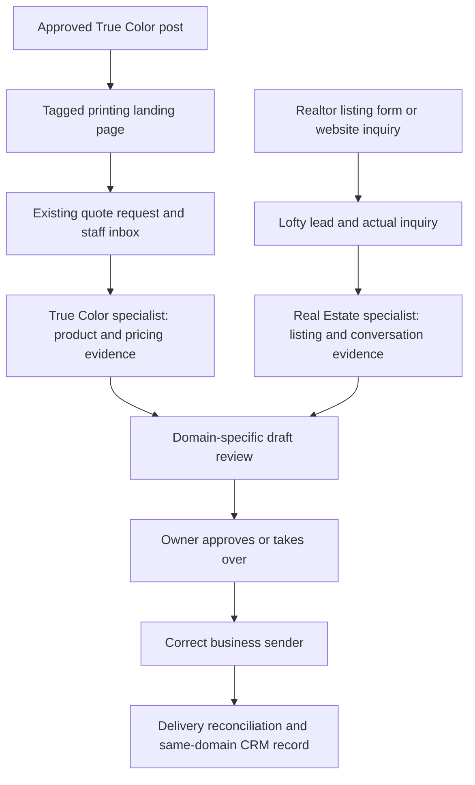

# Inquiry automation: audit and implementation proposal

September 6, 2026. Audit/design only. No campaign, customer message, subscription, gateway, or live setting changed. This sanitized plan keeps printing and real estate separate.

## Recommendation

Reuse the existing customer systems. Build a small, evidence-backed review flow before broader automated conversations. Posting creates visibility; an actual captured inquiry creates a lead. Measure useful answers, quotes and appointments, not post counts as conversions.

The shared review pattern does not imply shared contacts, databases, sender lines, permissions or templates. Default/Zara routes work to the existing specialist. Reuse stable domain topics and the shared supervision inbox; do not add a gateway or dashboard.

## Verified inventory and limits

| Surface | Evidence inspected this task | Gap |
|---|---|---|
| Canonical pricing repository | Clean local main at 40868735; isolated docs worktree created | Later remote changes were not fetched; this is the inspected baseline |
| True Color lead capture | ContactForm uses /api/quote-request; route persists quote_requests before success, handles duplicate submissions and attribution | Production submission, staff reply delivery and conversion attribution not exercised |
| Legacy /api/quote | Returns 501 | It is not the active contact-form route; do not build against it |
| Brevo customer sync | customerSync.ts uses order attributes and adds the customer list only on explicit opt-in | Live workflow enrollment/suppression and existing contact state not verified; code presence is not a running sequence |
| Social runtime | VPS timer active; recent service executions successful; saved runner result has four posted deliveries, two evening deliveries ready, held=false | Saved receipts are not fresh independent Meta readback; final pair pending at inspection |
| VPS application checkout | Exists but contains unrelated modifications/deletions and untracked preview work | Preserve it; Railway runtime is not proven by this checkout |
| Realtor reply pilot | Safe live status: two replies, one delivered ACK, paused, no uncertain owner notices; 38 tests passed | Narrow test only, not general nurture or autonomous conversation |
| CRM snapshot logger | One verified snapshot, zero unresolved intents; source has pre-write intent and reconciliation | Logger files uncommitted in operational repo; timer launcher invokes only reply pilot, not CRM logger |
| Lofty API | Test lead activity and native text-history reads returned successfully; native texts array empty | Does not prove actual property context, all-lead permissions, or external Twilio history ingestion |
| Owner supervision | Current domain registry/decision records inspected; recorded real return-path proof includes an 88-minute delay | Not an emergency stop channel; current end-to-end latency not retested |
| Realtor Brevo repository | Existing campaign repository present at 67a74bb | Actual live sequences, billing, memberships and sender conflicts remain unknown |
| Prior research | Existing source ledger recovered; NotebookLM access failed with expired auth | Prior 24-month generated draft is not deployment or Canadian compliance evidence |

## Build versus reuse

| Approach | Benefit | Main tradeoff / cost evidence |
|---|---|---|
| Existing Lofty integration and AI | Already designed around property inquiries, history and CRM tasks | Verify purchased entitlement, Canada limitations and exact pause settings. Account pricing not inspected |
| Existing True Color quote inbox | Keeps artwork, quantities, source and staff actions with the order workflow | Needs review-state and conversational history integration; no new CRM purchase proposed |
| Small Hermes supervisor | Consistent owner review and durable evidence using existing VPS | Engineering/maintenance plus model and provider usage; no measured incremental cost yet |
| New custom sender / CRM replacement | More control | Largest duplicate-message and data-sync burden; not recommended before existing access is audited |

Do not quote a monthly saving without actual Lofty entitlement, Brevo workflow, Twilio usage and model usage readbacks. Existing paid access is not automatically free incremental usage.

## Staged build and acceptance gates

1. **Finish recording first.** In the existing private operational pilot, review and version crm_log.py and its tests. Prepare launcher integration so CRM recording is independently retriable without replaying SMS; preserve poll failure visibility. Inspect current state before any live wiring. Verify a new snapshot once, replay unchanged input with no new note, simulate unknown POST and recover by readback. This plan does not install that wiring.
2. **Resolve actual inquiry context, read-only.** On one owner-selected real inquiry, inspect Lofty activities, current listing record, communication history including automated events, AI working-pool/mute state, active Smart Plans, next tasks, assignee and contact restrictions. Verify connected Facebook Page/form and its listing metadata. Inspect realtor Brevo enrollment before selecting a messaging owner. Empty/unknown evidence produces a blocked review item, not an invented due date.
3. **Produce one no-send review item.** Extend lofty_follow_up.py under tools/lofty-follow-up in hermes-ops; keep private review state in its existing protected project directory. For printing extend the existing staff quote workflow, not the 501 route. Fields: domain, lead/quote reference, source event ID/time, exact question, resource ID/version/checked time, current owner, permission evidence, latest reply, proposed response, verified next action/timezone, blocking reasons. No send adapter in this slice.
4. **Separate urgency.** New unanswered inquiries enter immediate review; measure capture-to-review latency. Quieter explicit due actions enter one daily review. Unknown dates remain needs_decision. Show oldest unanswered inquiry and failed/unknown CRM writes in the existing supervision inbox.
5. **One approved response.** Only after identity, permissions, source freshness, conversation ownership and stop controls pass: approve exact recipient/channel/body; recheck version and new replies before sending; persist intent first; reconcile delivery and CRM independently. No automatic retry of unknown send outcomes.
6. **Later narrow sequences.** Agree audience, helpful purpose, content, interval, contact window and maximum unanswered attempts before enabling. Default is zero automated follow-up sends. Pause on every reply/takeover/opt-out and on another sender's activity. No indefinite checking-in loop.

Success metrics: inquiry capture completeness, duplicate suppression, unanswered age, first useful response time, approved quote/showing requests, completed outcomes and opt-outs. Attribution uses source/event IDs; a scheduled showing request is not a confirmed appointment or a sale.

## Synthetic conversation previews — never sent

These are fictional examples of actual inquiry types, not real customer records or verified listing claims. Identification and applicable opt-out wording must be supplied by the eventual channel adapter.

**Printing / deadline and size**

Customer: “Can you do 20 lawn signs for Friday?”

Draft: “What size did you have in mind, and do you need stakes? If you have the artwork handy, send it over and we can check the price and Friday timing.”

Owner card: Quantity known; size, artwork and production capacity missing. Do not promise Friday or invent a quote. Once priced, use the current pricing engine and applicable taxes, not a model-generated number.

**Real estate / specific listing inquiry**

Customer: “Is the garage at [inquired address] heated?”

If the current authorized listing explicitly verifies heating: “Yes—the current listing describes the garage as heated. Would you like to see it in person?”

If not verified: “I’ll confirm whether the garage is heated before giving you a definite answer. Is there anything else about the property you’d like me to check?”

Owner card: Resolve the address from this inquiry event, attach the current source and capture time. Never substitute the lead's first-ever inquiry property.

**Real estate / showing request**

Customer: “Could we see that one Saturday afternoon?”

Draft: “What time Saturday works for you? I’ll check the showing availability for [inquired address].”

Owner card: This gathers a preference; it does not confirm seller access or an appointment. An unavailable/stale listing blocks availability assertions.

**Reply or opt-out**

Customer: “Actually, we already found somewhere.”

Review action: pause future follow-ups and show the owner the reply. A possible owner-approved response is “Thanks for letting me know.” Do not use it to start another sales pitch. STOP creates durable suppression and prevents automated replies except provider-required handling.

## Proof matrix

The tests below are acceptance criteria for the proposed broader system, not claims that the narrow pilot already covers them all.

| Failure / condition | Required proof before broader sending |
|---|---|
| Wrong business or recipient | Mismatched domain, CRM ID or phone fails closed; no cross-domain lookup fallback |
| Duplicate source event | Same provider event ID creates one review item across repeated ingestion and restart |
| Lofty/Brevo/Hermes ownership conflict | Active other sender or unknown ownership blocks send; automated communication history included |
| Stale or different listing | Latest inquiry resource selected; stale/deleted record produces verification task, no availability assertion |
| Missing consent/restrictions | Missing affirmative basis is unknown; opt-out blocks regardless of score or tags |
| Latency | Timestamp source, capture, draft, notification and acknowledgment separately; report measured percentile and oldest backlog |
| Missed notification | Durable attention remains until acknowledged; provider acceptance differs from owner receipt |
| Unknown SMS delivery | Intent survives timeout; reconcile provider history; never automatically repost |
| CRM failure | Retry/reconcile CRM independently; no duplicate SMS to repair logging |
| Stop/takeover | Durable independent control checked immediately before dispatch; accepted messages cannot be recalled |
| Reply race | New reply invalidates draft approval/version before send; one lead lock/claim controls concurrent workers |
| Restart/retries | Crash at every intent/write/receipt boundary preserves holds and deduplication |
| Webhook gaps | Poll communication history for AUTO events; persist cursor and reconcile after downtime |
| Prompt injection | Inquiry bodies treated as quoted customer data; cannot change policy, recipient or tools |
| Follow-up limit | Exhausted unanswered limit yields owner review; no endless sequence |

## Official research, checked September 6

- [Lofty Facebook forms](https://help.lofty.com/hc/en-us/articles/40531719664795-Facebook-Lead-Form-Ads-Lofty-Integration): listing IDs/search metadata can accompany imported forms. Verify the owner's actual connection; do not create a competing import.
- [Lofty AI Assistant](https://help.lofty.com/hc/en-us/articles/33090360187675-AI-Assistant): history/activity-aware assistance and listing/task capabilities, subject to actual entitlement.
- [Smart Plan FAQ](https://help.lofty.com/hc/en-us/articles/4419016941083-Smart-Plans-FAQs): initial-inquiry listing variables can differ from a later inquiry.
- [Activities API](https://developer.lofty.com/api-reference/leads/activities), [SMS history](https://developer.lofty.com/api-reference/communication/list-sms), [API index](https://developer.lofty.com/llms.txt): read source activity/history and verify ownership endpoints before implementation.
- [Lofty webhooks](https://developer.lofty.com/concepts/webhooks): automated communication events are excluded; use communication reads as well. Stable event identity supports retry deduplication. Do not invent a signing scheme absent a verified contract.
- [Canada feature availability](https://help.lofty.com/hc/en-us/articles/360056581812-Feature-Availability-for-Users-in-Canada): US product demos do not establish Canadian feature/data availability.
- [CRTC guidance](https://crtc.gc.ca/eng/com500/info.htm), [implied consent](https://crtc.gc.ca/eng/com500/guide.htm): requested responses and ongoing marketing need separate analysis; an inquiry is not unlimited recurring contact authority.
- [Twilio policy](https://www.twilio.com/en-us/legal/messaging-policy): consent is sender/topic-specific; inbound conversation is not blanket recurring-message consent. [Canada SMS](https://www.twilio.com/en-us/guidelines/ca/sms).
- [Meta Page replies](https://www.facebook.com/help/1698046970464236/), [selling surfaces](https://www.facebook.com/help/550954179351183/): lead forms, Page Messenger, Instagram and personal Marketplace are separate access surfaces. Posting permission does not prove inbox permission. Exact messaging API scopes/windows were not verified because developer page retrieval failed. Personal Marketplace automation is not established; keep owner handoff.

## Open evidence checklist

- [x] Resolve real repository, isolate documentation work and preserve dirty VPS/Vault work.
- [x] Inspect active timers, safe reply/CRM summaries and existing code; run 38 pilot tests.
- [x] Recover prior source ledger and current official capability research.
- [ ] Verify actual Facebook-to-Lofty Page/form mapping and one real listing inquiry.
- [ ] Verify active Lofty/Brevo sequences, AI ownership, Canadian listing permissions and account costs.
- [ ] Independently read back hosted deployment and remaining social deliveries in their owning task.
- [ ] Review CRM launcher integration, then implement the no-send due/draft slice with the matrix above.

No production runtime code was changed by this audit. Context/ownership evidence is insufficient to generate a meaningful real-lead draft yet; synthetic previews make the intended behavior reviewable without pretending those gaps are solved.
