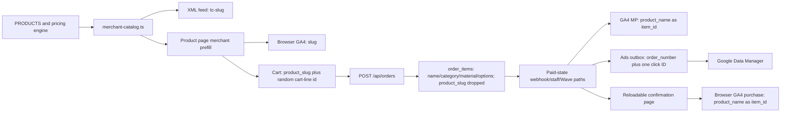

# Commerce SEO and Measurement Phase 0 Evidence Pack

**Captured:** 2026-08-31 (America/Regina)  
**Gate:** Gate 0 CLOSED  
**Scope:** read-only discovery and local planning only  
**Production/account mutations:** none

## State ledger

| State | Result |
| --- | --- |
| Implemented | This Phase 0 evidence pack only |
| Locally tested | Repo/worktree/deployment identity, public HTTP/feed checks, current GSC opportunity report, current paid-funnel report, Ads pacing report, paused-state Ads verifier |
| Pushed | No |
| Deployed | No |
| Live read-back | Yes, read-only checks documented below |
| Merchant-approved | Not established; processed item status was not available through the repo |
| GSC-observed | Yes; no `/products/*` snapshot rows in the latest 28-day window |
| Ads-observed | Yes; all three campaigns paused, verifier `UNSAFE` |
| Bidding-eligible | No |

## Repository, worktree, and deployment truth

- Remote: `tubby124/truecolor-estimator`.
- The registered local `main` checkout is `/Users/owner/Downloads/Businesses/TrueColor/TRUE COLOR PRICING /truecolor-estimator` at `24d649e`, clean and 11 commits behind `origin/main`. It was not modified.
- Historical checkout `/Users/owner/Downloads/TRUE COLOR PRICING /order-message-tracking` remains on `fix/google-ads-outbox-null-guard` at `8ffa6ae`. It was not modified.
- A fetch advanced `origin/main` from the previously observed `294e9b6` to `92464d359ad5add01a9657063e79b1fb646ec80c`.
- Fresh worktree: `/Users/owner/Downloads/TRUE COLOR PRICING /commerce-seo-phase0-20260831`.
- Branch: `codex/commerce-seo-phase0-20260831`, created from and tracking `origin/main` at `92464d3`.
- Railway production deployment `6ac8b5dc-efc0-451f-a53b-818466a40843` is `SUCCESS` and reports commit `92464d3`, branch `main`, created `2026-08-30T16:27:37.496Z`.
- GitHub deployment status on `92464d3` is also successful for `truecolordisplayprinting - truecolor-estimator`.
- Current deployed package baseline is Next.js `16.2.11` and React `19.2.3`; older repo prose that says Next.js `16.1.6` is stale.
- The `ppc-recovery-20260810` worktree is heavily dirty and is an explicit no-ship implementation base.

## Phase 0 lanes

1. Repository and data-flow architecture: repo rules, package scripts, feed, product page, cart, checkout, orders, order items, payment confirmation, GA4, Ads outbox, GSC/GA4 sync, migrations, and tests.
2. Current official documentation: Google Merchant API/specification, Search product/variant markup, spam and AI-search guidance, GA4 ecommerce/Measurement Protocol, Google Ads Data Manager/enhanced conversions/calls, and Next.js JSON-LD/sitemap/robots.
3. Live evidence: public feed/pages/policies, GSC, GA4 paid funnel, Ads status/diagnostics, Railway deployment identity, and sanitized first-party order/outbox aggregates.

## Current architecture and identity flow

The repo has three independently maintained catalog surfaces: 171 pricing CSV rows, 27 content-product slugs, and 16 manually seeded Merchant offers. They can drift independently unless the pilot introduces one tested contract.

### Confirmed identity mismatches

| Surface | Current value |
| --- | --- |
| Merchant offer ID | `tc-${slug}` |
| Product-page/browser GA4 item ID | normally `${slug}` |
| Some configurator item IDs | category or material code |
| Cart | has `product_slug`, but line `id` is a random UUID |
| `order_items` | has product name/category/material/options; no stable commerce ID |
| Browser confirmed-purchase item ID | `product_name` |
| Server Measurement Protocol item ID | `product_name` |
| GA4 purchase transaction ID | order UUID |
| Ads/Data Manager transaction ID | human order number |

The systems cannot currently join a feed offer to a paid line without name/slug heuristics. This blocks trustworthy product-level Merchant/GA4/Ads reconciliation.

## Live read-back baseline

### Merchant and product surfaces

- Owner-supplied Merchant Center account ID: `5847204541`, believed to be administered through the `hasan.sharif.realtor` Google login. This establishes the intended account identity but is not yet an API/UI readback of its data source or product status.
- `https://truecolorprinting.ca/feed/products.xml`: HTTP 200, 16 offers.
- IDs follow `tc-${slug}` and links use `/products/${slug}?merchant=tc-${slug}`.
- Every offer declares `in_stock`, Canada, `Local pickup (Saskatoon)`, and `0.00 CAD` shipping. This is not accepted as business truth without owner confirmation.
- Every offer also shares one broad Google product category; category accuracy must be validated per pilot rather than inherited blindly.
- `https://truecolorprinting.ca/products/stickers?merchant=tc-stickers`: HTTP 200 and server HTML contains visible price text, but returns `X-Robots-Tag: noindex, follow`, emits matching noindex metadata, has no self-canonical, and has no `Product` JSON-LD. Existing JSON-LD is organization/service/breadcrumb data.
- `/returns` and `/shipping`: HTTP 404.
- The repo contains XML feed generation but no Merchant API processed-product/status reader. Feed availability is not Merchant approval.

### GSC and organic

- Fresh 28-day opportunity report generated `2026-09-01T03:50:55Z`: 10 page-two opportunities, 5 title candidates, 0 new-page candidates, and 5 decay alerts.
- The current GSC snapshot runs through `2026-08-28`: 5,685 rows across 101 pages and 1,361 queries, with 57 clicks and 9,002 impressions. The latest sync completed `ok` at `2026-08-31T19:33:26Z`.
- Direct snapshot query found zero rows, impressions, or clicks for URLs matching `/products/*` in the latest 28-day window.
- Protected pages and current decay signals prohibit an unrelated title/content wave during the commerce pilot.
- Net-new city/location expansion remains frozen.
- The stored GA4 snapshot is organic-only, through `2026-08-29`: 328 sessions, 235 engaged sessions, and 10 conversions. Direct all-channel `Unassigned` purchase classification was not available in the local credential environment and is therefore an unknown, not a current confirmed count.

### Ads, GA4, and first-party outcomes

- 30-day account window `2026-08-03` through `2026-09-01`: 377 clicks and CA$608.86 spend.
- All three campaigns are paused. Current paused-state verifier result is `UNSAFE`.
- Two `purchase_online` rows were ad-attributed and sent: CA$51.82 and CA$87.50.
- 24 website quotes; 2 had a Google paid click ID; 2 qualified-lead conversions were sent; no click-ID quote converted during the window, so quote-to-order click-ID survival is still unproven.
- 49 paid sales were not attributable to Ads: 13 online checkout, 29 staff manual, and 7 staff quote. The report found no Google-tagged online checkout that lost a click ID in this window.
- 31 synthetic `tc_core` sessions remain in the 30-day window and must be excluded from baselines/bidding.
- Enhanced-conversion email/phone hashes are currently accepted and sent on conversion uploads. This conflicts with the repo operating plan and owner-approval boundary.
- Paused campaigns do not stop those uploads. The current worker enriches claimed rows with email/phone whenever present, has no per-purpose Ads consent lookup or denied/unknown/revoked path, and does not send an event-level `adUserData` consent signal.
- Call reporting and a reviewed 60-second action exist, but the call asset has no campaign links. A tel-link tap remains a separate intent event.
- The paid-funnel output exposed that a signed `/pay/...` path containing encoded customer data reached GA4 landing-path reporting. Raw values are intentionally omitted here. This is a privacy no-ship defect.
- Direct local Ads OAuth failed with `invalid_grant`; the successful current readback above used Railway-managed production credentials. Account evidence must continue to use the credential-capable Railway path until local OAuth is repaired.

### First-party payment reconciliation

- The 30-day reconcile harness reported 53 paid Supabase orders totalling CA$7,538.14.
- Clover reported 59 successful payments totalling CA$8,330.37: 35 online payments (CA$4,855.82) and 24 POS/device payments (CA$3,474.55).
- No hard three-way mismatch was reported; all paid-status orders had `paid_at` and Wave income markers.
- Advisory gaps remain: 17 card orders lacked conclusive website-payment amount matching and 19 online Clover payments had ambiguous amount/time matches.
- Test-order filtering excluded `TEST-%`; no synthetic test order was in the 30-day paid-like set.
- Ads outbox aggregate: 2 sent `purchase_online` rows totalling CA$139.32, 44 not-attributable purchases, 5 not-attributable `quote_won` rows, and no pending/retry/dead rows. Local sent status is not the same as Ads acceptance/readback.

### Production health

- `/api/health` returned HTTP 200 with no failures and one warning: `PAYMENT_TOKEN_SECRET` is below the preferred entropy standard.
- Do not rotate that secret casually: rotation would invalidate outstanding signed payment links. Remediation needs a low-risk rotation/migration plan and is separate from the commerce pilot.

## Target contracts for Gate 1

### Stable commerce identity

- Canonical family helper: `commerceProductId(slug) -> tc-${slug}` in a new small module such as `src/lib/commerce/identity.ts`.
- Keep `commerce_product_id` distinct from an immutable `merchant_offer_id` plus offer/configuration version. A Merchant fixed offer cannot be reconciled exactly from the family slug after a buyer changes size, quantity, material, or another option.
- Persist both identifiers and original landing-offer provenance on the cart/order line. GA4 `item_id` uses the stable family ID; Merchant reconciliation uses the exact offer ID/version.
- Size, material, finish, sides, colour, and other selections belong in `item_variant` and explicit line fields, not in `item_id`.
- Manual/custom/legacy lines stay `NULL` unless an exact mapping is known. No name-based historical backfill.
- GA4 `transaction_id` remains the immutable order UUID unless the final architecture review chooses one different non-PII key for both GA4 and Ads. Any deliberate GA4/Ads difference must be documented.

### Purchase and delivery idempotency

- Add immutable `business_event_id` identifiers, including a distinct ID for every partial refund/reversal. Do not deduplicate multiple refunds only on purchase transaction ID plus event name.
- Enqueue analytics delivery atomically with the paid/refunded business-state transition through a transaction or database RPC/trigger; transport retry state belongs in a delivery ledger keyed by destination and business event.
- Make server-confirmed payment the only normal purchase source. Browser confirmation is display-only; localStorage is not a cross-device/server idempotency guarantee.
- Capture consented browser GA identifiers at checkout only after privacy approval. Do not synthesize a replacement client/session identity for attribution.
- Preserve the original purchase transaction ID as the attribution reference for refunds/cancellations while using the unique refund/reversal business-event ID for delivery deduplication.
- Treat submitted, transport-accepted, validated, and observed as separate GA4 states. Require GA4 readback proving exactly one purchase per transaction.

### Consent and PII

- Marketing/CASL consent is not automatically Ads customer-data consent.
- Before Phase 1, add a server-side default-off enhanced-conversion kill switch. Persist actual consent purpose/version/state/evidence; re-check it after queue claim and immediately before upload; send Google's event-level consent signal; omit user data for denied, unknown, or revoked states.
- Hash only at the final server boundary; never log raw PII or hashes.
- Suppress all analytics/tag bootstrap and attribution storage on `/pay` before the first pageview. Replace decodable signed URL payloads with opaque random server-side tokens, add strict referrer/no-store controls, and audit existing analytics/storage/log surfaces. Page-location redaction alone is insufficient.

## File-level implementation plan

### Phase 1: identity and truthful measurement

| Area | Planned files |
| --- | --- |
| Stable ID helper | new `src/lib/commerce/identity.ts` plus focused unit tests |
| Cart/event contract | `src/lib/cart/cart.ts`, `src/lib/analytics.ts`, product configurators, checkout item builders |
| Persistence | new forward-only nullable Supabase migration; `src/app/api/orders/route.ts`; quote/manual order materialization paths |
| GA4 delivery | `src/lib/analytics/measurementProtocol.ts`, paid-state callers, display-only confirmation component, atomic business-event delivery ledger/outbox |
| Ads reconciliation | preserve current `google_ads_conversion_outbox`; document/align transaction ID semantics; do not add a second primary purchase path |
| Privacy | default-off Ads user-data switch; consented GA identifier capture only after approval; `/pay` analytics suppression; opaque payment-token migration; downstream URL audit/deletion plan |
| Tests | online, manual, quote, legacy-null, webhook retry, confirmation reload, partial/full refund, consent denied/revoked, no-PII log tests |

### Phase 2: one Merchant/product pilot

| Area | Planned files |
| --- | --- |
| Catalog contract | refactor `src/lib/merchant/merchant-catalog.ts` to consume the stable commerce record |
| Product page | `src/app/products/[slug]/page.tsx`: server-render exact pilot configuration, visible price/availability/purchase action, canonical, and Product/Offer JSON-LD |
| Headers/robots | keep `noindex` unless processed-item diagnostics prove it blocks approval and the SEO owner approves the intent map; protect every other product/private route |
| Sitemap | add a pilot URL only if it is deliberately made indexable; no query variants or fake `lastModified` |
| Policies | new public policy routes only from owner-confirmed text; never infer return/shipping terms |
| Merchant diagnostics | add a read-only Merchant API status command using the existing account/data source; do not create a second account/data source |
| Tests | feed/page/schema/checkout/receipt ID-price-currency-availability-policy parity matrix |

### Phase 3: Ads/Data Manager and calls

- Keep campaigns paused.
- Preserve the durable Ads outbox and exactly one click identifier.
- Add the default-off enhanced-conversion kill switch before Phase 1, then require approved consent/terms before any re-enable; current unconditional user-data inclusion must not survive.
- Keep `quote_submit_qualified`, click-to-call, and duration-qualified calls secondary during validation.
- Do not make any conversion bidding-eligible until first-party reconciliation and the final no-ship review pass.

## Product/feed/schema parity matrix

| Field | Feed now | Page now | Cart/order now | Target |
| --- | --- | --- | --- | --- |
| Stable ID | `tc-slug` | no Product/SKU | slug dropped before persistence | exact `tc-slug` everywhere |
| Price | fixed selected offer | server-visible merchant-prefill price | recalculated server-side | exact parity test |
| Currency | CAD | CAD copy | CAD totals | CAD everywhere |
| Availability | always `in_stock` | not structured | purchaseability varies | derived truth, pilot only |
| Shipping | CA + pickup + $0 | pickup copy | no delivery contract | owner-confirmed policy |
| Returns | absent | policy route 404 | absent | owner-confirmed policy |
| Canonical | query-param link | missing | n/a | clean self-canonical |
| Indexability | feed requires a crawlable landing | crawlable but noindex | n/a | retain noindex unless diagnostics and SEO intent justify indexation |

## GA4 and Ads deduplication matrix

| Path | Current guard | Gap | Target |
| --- | --- | --- | --- |
| Browser purchase | localStorage by order number | device/storage scoped only | display-only; no purchase emission |
| Clover MP purchase | paid transition plus fire-and-forget | no atomic delivery ledger | durable idempotent server-only delivery |
| Staff confirmations | route-specific send | no shared ledger | shared paid-event outbox |
| Wave MP purchase | effect outbox | separate from other payment paths | shared destination ledger |
| Ads purchase/quote won | DB outbox + unique order | generally sound | retain; align transaction contract |
| Refund/cancel | incomplete commerce event contract | multiple partial refunds can collide | unique refund/reversal event ID plus original purchase reference |

## Call measurement ladder

1. `click_to_call`: tel-link interaction, diagnostic intent only.
2. `qualified_call_60s` / website-call action: Google forwarding-number duration proxy, secondary.
3. CRM-confirmed booked/paid call: business outcome; only this can be treated as revenue without pretending duration equals revenue.

## Risk register and release controls

| Risk | Owner | Required test/evidence | Rollback/stop |
| --- | --- | --- | --- |
| Shipping/returns claims are unverified | Owner | signed operating policy and checkout parity | keep feed/pilot noindex or remove pilot item |
| Enhanced conversions lack explicit approval/consent contract | Owner + engineering | terms, privacy text, consent states, deletion flow | keep campaigns paused; disable user-data path after approved change |
| Payment URL data reaches GA4/storage/logs | Engineering/privacy | no-tag first response, opaque-token tests, downstream audit/deletion evidence | block analytics on `/pay`; owner-gated legacy link response |
| Item IDs diverge across systems | Engineering | one-order trace matrix | Gate 1 remains closed |
| Browser and MP purchase duplication | Engineering | webhook/reload/cross-device retry tests | disable browser purchase fallback |
| Product page cannibalizes protected service page | SEO owner | GSC URL/query monitoring for 5-7 days | restore noindex/remove sitemap pilot |
| Feed/page/checkout drift from cache/regeneration | Engineering | same-build contract plus live probes | feed kill switch/remove pilot item |
| Pricing/content/Merchant catalogs drift independently | Engineering | contract test across CSV, content record, offer and checkout | remove pilot offer |
| Static broad Google product category is inaccurate | Merchant owner | processed-product classification/readback | correct pilot only or remove offer |
| Synthetic/staff traffic pollutes bidding | Analytics owner | exclusion proof and clean test markers | keep events secondary/campaigns paused |
| Call proxy promoted as revenue | Owner | threshold and CRM reconciliation | keep call actions secondary/unlinked |
| Ads verifier is `UNSAFE` | Ads owner | all blockers cleared and read back | campaigns remain paused |
| Repo tax rules conflict | Owner + engineering | authoritative tax decision and four-surface parity tests | no tax behavior change |
| GSC sync retains disappeared rows | Engineering | bounded per-day replacement regression test | do not use stale rows for release decisions |
| Multiple refunds collapse or state transition loses enqueue | Engineering | partial refund/reversal and crash/race tests | disable new delivery worker and safely requeue ambiguous rows |
| Schema/worker rollout is incompatible | Engineering/DB | old-app/new-schema and new-app/legacy-null tests, lock/size preflight, service-role ACL | migration then dual-compatible app then worker; pause/resume cron; preserve nullable schema |

## Explicit no-ship list

1. Sol Ultra red-team verdict is `BLOCK`: 2 critical and 5 high-severity findings remain open.
2. No product indexation while policy, identity, deduplication, and Merchant processed status remain unresolved.
3. No Merchant bulk rollout; one owner-approved fixed-price pilot only.
4. No new Merchant account or duplicate data source.
5. No Ads budget, bid, targeting, goal, asset-link, or campaign activation.
6. No continued unconditional Enhanced Conversion user-data upload; paused campaigns are not containment. Immediate shutdown/remediation remains owner-gated because it changes production behavior.
7. No call action promoted to primary and no call asset linked.
8. No new city/location pages.
9. No fake GTIN, rating, review, inventory, availability, shipping, return, or deadline facts.
10. No Vault update until implementation/deployment/live states are independently verified.
11. No tax behavior change while `truecolor-domain.md`, payment/tax rules, and current code disagree.
12. No duplicate managed GSC migration until live migration history is checked; the original GSC table migration lives outside `supabase/migrations`.
13. No payment-token secret rotation without an outstanding-link migration/reissue plan; rotation invalidates current links.
14. No analytics or attribution bootstrap on `/pay` in the target design; no raw or hashed customer identifiers in logs/diagnostics.

## Owner decisions required to pass Gate 0

1. **Pilot and eligibility:** which exact product/configuration is genuinely purchasable online and should be the only pilot?
2. **Fulfilment truth:** Saskatoon pickup only, local courier, and/or Canada-wide shipping; exact cost/coverage/lead-time rules.
3. **Return/refund truth:** exact policy for custom print, defects/reprints, cancellations, and any non-custom item.
4. **Enhanced conversions/privacy:** approve or reject sending consented hashed email/phone to Google; confirm Ads terms/privacy disclosure and consent purpose.
   - Also decide whether to immediately disable current uploads and how previously uploaded hashes should be treated for deletion/remediation.
5. **Calls:** approve or reject the 60-second qualification threshold and later call-asset linking.
6. **Future bidding outcome:** recommended default is `purchase_online`; should `quote_won` remain secondary until its click-ID path has an observed converted example?
7. **Tax authority:** confirm the intended PST treatment for printed items, bundled design/rush/setup, and standalone `SVC-` service lines before any checkout/schema policy change.
8. **Payment-token incident response:** approve the containment, analytics/storage/log audit, opaque-token migration, and handling/reissue of outstanding payment links.

### Engineering defaults; not owner questions

- GA4 purchase emission will be server-only, with browser confirmation display-only.
- Exact fixed-offer provenance will use immutable `merchant_offer_id`/version; family-level attribution is not accepted as exact reconciliation.
- The crawlable product pilot will remain `noindex` unless Merchant processed-item diagnostics prove a problem and a separate SEO intent/cannibalization review supports indexation.

## Gate 0 pass criteria

- Fresh worktree, current origin, deployed commit, current official docs, and current live readbacks are documented.
- Owner decisions above are resolved in writing.
- Both critical findings and all high-severity red-team findings are resolved with tests/readback, and the Sol Ultra re-review returns no material block.
- Only then may Phase 1 migration/tracking changes begin.

## Sol Ultra architecture red-team verdict

**Verdict:** `BLOCK` — Gate 0 cannot pass.

| Severity | Count | Material findings |
| --- | ---: | --- |
| Critical | 2 | Enhanced-conversion identifiers upload without a valid per-purpose consent gate; decodable signed payment URLs can leak customer/order data to analytics, storage, referrers, history, or logs |
| High | 5 | Partial-refund dedup/atomicity; unresolved GA4 browser/server ownership and synthetic identity; family slug cannot prove fixed-offer identity; unnecessary indexation assumption and missing initial-HTML parity; incomplete migration/rollback sequencing |

Required target architecture from this review:

1. Default-off enhanced-conversion user data before Phase 1, with event-level consent and owner-approved remediation.
2. No analytics on `/pay` before bootstrap; opaque server-side tokens and an owner-approved legacy-link/data-deletion plan.
3. Server-only GA4 purchase ownership, real consented client/session IDs, durable atomic delivery, and observed-once readback.
4. Separate family product ID from immutable Merchant offer ID/version and retain landing-offer provenance.
5. Keep product pages crawlable but `noindex` unless processed-item evidence and the SEO intent map justify indexation; render exact offer truth in initial HTML.
6. Expand/contract rollout: migration, dual-compatible app, worker, live readback; cron pause/resume, service-role-only ledger access, in-flight recovery, and additive rollback.

## Current official references

- [Merchant API products](https://developers.google.com/merchant/api/guides/products/overview)
- [Merchant product specification](https://support.google.com/merchants/answer/7052112)
- [Merchant listing structured data](https://developers.google.com/search/docs/appearance/structured-data/merchant-listing)
- [Product variants](https://developers.google.com/search/docs/appearance/structured-data/product-variants)
- [Google spam policies](https://developers.google.com/search/docs/essentials/spam-policies)
- [Google AI-search guidance](https://developers.google.com/search/docs/appearance/ai-features)
- [GA4 ecommerce](https://developers.google.com/analytics/devguides/collection/ga4/ecommerce)
- [GA4 Measurement Protocol](https://developers.google.com/analytics/devguides/collection/protocol/ga4)
- [Google Data Manager events](https://developers.google.com/data-manager/api/devguides/events/send-events)
- [Enhanced conversions for leads](https://support.google.com/google-ads/answer/15707550)
- [Primary and secondary actions](https://support.google.com/google-ads/answer/10993988)
- [Call conversions](https://support.google.com/google-ads/answer/6095882)
- [Next.js JSON-LD](https://nextjs.org/docs/app/guides/json-ld)
- [Next.js sitemap](https://nextjs.org/docs/app/api-reference/file-conventions/metadata/sitemap)
- [Next.js robots](https://nextjs.org/docs/app/api-reference/file-conventions/metadata/robots)
