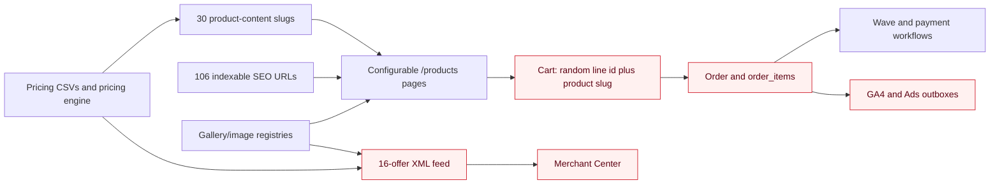

# True Color commerce, SEO, Merchant, catalog, image, and future Ads audit

**Date:** 2026-09-02
**Workspace:** isolated worktree `commerce-seo-phase0-20260831` on branch `codex/commerce-seo-phase0-20260831`
**Status:** audit and proposed plan only; implementation approval not yet granted
**External state:** read-only inspection only; no Merchant edits, deploy, push, deletion, publication, campaign change, or customer communication

## Executive decision

Do not activate the code feed, replace the 25 manual Merchant items, index the configurable product pages, or expand Google Ads yet.

The store has a working pricing engine, cart, server repricing, order creation, payment integrations, and a public 16-offer XML feed. It does not yet have one durable commerce identity across feed → page → cart → order → analytics, and the current feed's fulfillment statement is materially unsafe: it expresses `0.00 CAD` under a Canada-wide `shipping` block while the actual no-cost option is pickup at 216 33rd St W. Shipping is quote-only. The public site also lets a customer self-select rush while the current operating rule is that rush is available only after capacity confirmation.

Merchant Center account **5847204541** currently shows 25 manually entered products. The Products overview calls all 25 **Limited**; marketing-method diagnostics calls them **Not approved**. The account shows 0 approved products, 7 clicks over the last 28 days, and these issue counts:

- 17 missing shipping information;
- 8 missing price;
- 7 missing landing page;
- 25 requiring attention.

The right sequence is therefore:

1. Freeze the current external state and establish canonical identity, fulfillment, return, price, tax, and image evidence.
2. Repair the website and checkout truth path without changing active SEO experiments.
3. Process one exact physical-product Merchant pilot and prove parity and rollback.
4. Roll out the remaining eligible offers one family at a time.
5. Exclude or archive each manual item only after its replacement is live and deduplication-safe; do not delete it.
6. Consider product-page indexing and Ads only after Merchant, conversion, consent, revenue, and operations gates pass.

## Evidence and confidence

### Read-only evidence gathered on 2026-09-02

- Repository instructions, pricing/catalog code, order, checkout, analytics, schema, sitemap, image, and current SEO sprint files.
- Public production responses for the home page, XML feed, product pages, robots, main sitemap, image sitemap, `/returns`, and `/shipping`.
- Live Merchant Center UI for account 5847204541, including all 25 manual product titles, IDs, prices, and issue groups.
- Privacy-safe production order aggregates covering 2026-02-23 through 2026-09-02. No customer name, email, phone, address, artwork path, order ID, or line-level customer record was retained in this audit.
- A fresh 28-day Search Console opportunity/decay analysis plus the repository SEO sprint ledger.
- Current gallery manifest, public image directory, image sitemap, and scheduled GBP/social asset references.
- Current Google primary documentation for product data, landing pages, custom products, unsupported services, local pickup, product images, structured data, GA4 ecommerce events, Measurement Protocol, and consent.

### Important scope limits

- Merchant item detail pages were not edited. Titles, IDs, visible prices, and issue groups were captured; exact legacy size/material/quantity variants still need a dated export or item-detail snapshot before a 1:1 cutover.
- The order analysis is directional product-demand evidence, not audited financial reporting. “Strictly paid” means a paid lifecycle state with a populated `paid_at` timestamp.
- Historical acquisition is too sparse for bidding decisions: 203 of 222 orders have `unknown` acquisition source.
- No current-code validation is represented as implementation validation. No implementation occurred in this phase.

## Owner-approved business truth

These facts override older copy, schedules, comments, and prior plans:

| Topic | Authoritative rule |
|---|---|
| Pickup | Free pickup at 216 33rd St W, Saskatoon. Pickup is not shipping. |
| Standard production | 2–3 business days after both artwork approval and payment. |
| Rush | Available only after staff confirms capacity. It is not an unconditional same-day promise. |
| Shipping | Quote-only from final job and destination details. Do not invent rates, timing, carriers, zones, or free-shipping claims. |
| Returns | Custom prints are final sale except verified defects or True Color errors reported within 48 hours. |
| Privacy | Customer identity, artwork, order details, and analytics data stay private; no customer work may be reused without recorded permission. |

### Confirmed truth drift

The codebase still contains broad 1–3-day, “48-hour,” same-day/+40, “order before 10,” courier-price/range, shipping-time, shipping-across-SK, and “Roland UV printer” claims. The actual printer named in the central business record is a Roland TrueVIS VG2 eco-solvent printer/cutter. Drift appears in product copy, regional pages, GBP content, social schedules, and terms—not just one component.

This is an operations and policy risk, but it must not be “fixed” by mass-editing protected SEO pages in one wave. The implementation plan below centralizes truth first, blocks future outbound reuse, and then uses measured factual correction waves that respect the two-page SEO wave cap and active experiment holds.

## Current architecture and failure path

The pricing engine is the strongest current source. The identity chain around it is not durable:

- Feed ID is `tc-${slug}` and represents both a family and one mutable configuration.
- Product analytics use the product slug for most browser funnel events.
- Cart lines have a random UUID plus `product_slug`.
- `order_items` omit product slug, Merchant offer ID, configuration fingerprint, and pricing version.
- Server-side purchase events fall back to product name as `item_id`.
- The same product can therefore have a family slug, mutable feed ID, random cart ID, and name-based paid-event ID.

## Target catalog taxonomy

The catalog should use five explicitly separate layers.

| Layer | Purpose | Stable key | Example |
|---|---|---|---|
| Product family | Durable commercial identity | `commerce_product_id` | `tc:family:stickers` |
| Sellable variant | Exact material, dimensions, sides, quantity, finish, and included add-ons | deterministic `variant_key` | `2x2--1s--q25--mat-sticker` |
| Channel offer | Stable Merchant/Ads identity for one exact physical configuration | `merchant_offer_id` + separate `offer_version` | `tc-stickers--2x2--1s--q25--mat-dpf510` |
| Organic intent page | Search intent and education; may link to several exact offers | canonical URL | `/sticker-printing-saskatoon` |
| Industry/season/use case | Supporting niche intent; never treated as a distinct product unless it really has its own exact offer | canonical URL + parent family | `/construction-signs-saskatoon` → coroplast/ACP/banner families |

Services and add-ons are a sixth, explicitly non-Merchant layer. Graphic design, artwork setup, rush, installation, and shipping quotes must never be disguised as retail products or bundled into a Merchant offer.

### Minimum canonical fields

The shared offer record should contain:

- `commerce_product_id` — immutable family identity;
- `variant_key` and `configuration_fingerprint` — deterministic from normalized material, dimensions, sides, quantity, finish, and included physical add-ons;
- `merchant_offer_id` — stable for the lifetime of one exact physical configuration; never silently reuse it for a materially different product/configuration;
- `offer_version` — append-only payload/configuration receipt version; routine price, availability, title, policy, and approved-image updates do **not** churn the Merchant item ID when the underlying product configuration is still the same;
- `pricing_version`, `pricing_rule_id`, and `price_as_of`;
- `product_slug` and `seo_landing_path`;
- exact CAD price, price type, tax class, and pricing provenance;
- acceptance/availability state derived from whether True Color is accepting the exact order, not hardcoded stock;
- fulfillment eligibility: pickup, shipping-quote-only, or ineligible;
- exact image asset ID, content hash, rights/privacy status, and Merchant eligibility;
- Google product category and internal category;
- `merchant_eligible`, `merchant_exclusion_reason`, and lifecycle status;
- creation, activation, replacement, exclusion, and rollback receipt references.

The same immutable identifiers must persist into cart, `order_items`, GA4 items, payment events, and the Merchant crosswalk.

## Current catalog surfaces

The site has three overlapping catalog surfaces:

1. Pricing tables/engine: 171 pricing rows in the prior Phase 0 inventory.
2. Product content/configurators: 30 current slugs.
3. Code Merchant feed: 16 physical offers.

The 30 product-content slugs comprise:

- 16 current feed families: coroplast signs, vinyl banners, vehicle magnets, business cards, flyers, ACP signs, foamboard displays, window decals, window perf, vinyl lettering, retractable banners, stickers, postcards, brochures, photo posters, and magnet calendars;
- 5 label subtypes: product labels, cosmetic labels, freezer labels, candle-jar labels, and roll labels;
- 5 other physical candidates: boat registration numbers, rack cards, door hangers, coil-bound booklets, and custom-shape signs;
- 4 services: logo vectorization, image upscale, custom logo design, and artwork setup.

Eligibility is currently implicit by omission from the 16-slug allowlist. The new model must make both eligibility and exclusion reason explicit.

### Current product-state exceptions

The current 30-page catalog should not be interpreted as 30 clean self-serve products:

- 29 pages are active/orderable; Door Hangers is explicitly `comingSoon`.
- Custom-Shape Signs describes a $50 cutting setup and optional ACP, but the live configurator uses the ordinary coroplast sign path without a cut-setup or ACP selection. Treat it as quote-only until the pricing contract matches the promise.
- Sticker content says custom shapes are quote-only while the cart/configurator accepts circle/die-cut states. Resolve this before expanding sticker offers.
- Roll Labels are currently supplied as die-cut sheets for the normal path; applicator-wound rolls need core/wind/run confirmation and remain quote-only.
- Magnet Calendar content sends 50+ quantities to a quote even though the UI exposes 50/100 presets. Resolve the contradiction before any Merchant use.
- Custom booklet page counts/one-offs, installed or fleet vehicle graphics, wraps, cardstock cards/invitations, paper/document printing, removal/reinstall, and delivery remain quote-only.
- Four fixed-price services are internally orderable—logo vectorization $40, image upscale $20, custom logo design $40, and artwork setup $40—but remain Merchant-ineligible.

This distinction should be encoded in data, not inferred from UI behavior or omission.

### Thirty-slug taxonomy ledger

| Product-content slug | Current commerce mode | Merchant outcome |
|---|---|---|
| `coroplast-signs` | Configurable physical | Exact variant candidate; current feed included. |
| `vinyl-banners` | Configurable physical | Exact variant candidate; current feed included. |
| `vehicle-magnets` | Configurable physical | Exact variant candidate; demand-validation hold. |
| `business-cards` | Fixed lot physical | Exact variant candidate; current feed included. |
| `flyers` | Fixed lot physical | Exact variant candidate; current feed included; SEO experiment hold. |
| `acp-signs` | Configurable physical | Exact variant candidate; current feed included. |
| `foamboard-displays` | Configurable physical | Exact variant candidate after material provenance. |
| `window-decals` | Configurable physical | Exact variant candidate; current feed included. |
| `window-perf` | Configurable physical | Exact variant candidate; demand-validation hold. |
| `vinyl-lettering` | Configurable physical | Exact print-only variant candidate; installation excluded. |
| `boat-registration-numbers` | Fixed physical decal pair/name | Future candidate only after repeat demand, exact image, and vehicle/lettering identity review. |
| `retractable-banners` | Fixed package tiers | Exact Economy package candidate; current feed included. |
| `stickers` | Configurable physical | Exact variant candidate after material/custom-shape contradiction is resolved. |
| `product-labels` | Sticker/label acquisition alias | Do not duplicate; map exact physical offer to sticker family. |
| `cosmetic-labels` | Sticker/label acquisition alias | Do not duplicate; map exact physical offer to sticker family. |
| `freezer-labels` | Sticker/label acquisition alias | Do not duplicate; map exact physical offer to sticker family. |
| `candle-jar-labels` | Sticker/label acquisition alias | Do not duplicate; map exact physical offer to sticker family. |
| `roll-labels` | Sheet-label self-serve plus applicator quote intent | Hold; separate sheet product truth from wound-roll quote workflow. |
| `postcards` | Fixed lot physical | Exact variant candidate; current feed included. |
| `brochures` | Fixed fold/lot physical | Candidate after supplier/material-cost provenance. |
| `rack-cards` | Fixed 4×9 physical | Future candidate after repeat demand and image/ops proof. |
| `door-hangers` | Coming soon | Exclude. |
| `photo-posters` | Fixed size physical | Exact variant candidate; current feed included. |
| `magnet-calendars` | Configurable physical | Hold until 50+/UI quote contradiction and demand are resolved. |
| `coil-bound-booklets` | Fixed approximately-80-page lots | Future candidate after supplier-cost and repeat-demand proof. |
| `custom-shape-signs` | Current price contract incomplete | Quote-only; exclude until cutting/material options are authoritative. |
| `logo-vectorization` | Fixed-price service | Merchant-ineligible. |
| `image-upscale` | Fixed-price service | Merchant-ineligible. |
| `custom-logo-design` | Fixed-price service | Merchant-ineligible. |
| `artwork-setup` | Fixed-price service | Merchant-ineligible. |

## Historical demand and product gaps

Read-only production aggregate, 2026-02-23 through 2026-09-02:

- 222 orders total;
- 172 strictly paid orders;
- 276 item rows;
- 0 rows classified as test/orphan by the safe audit filter;
- lifecycle counts: 174 complete, 6 ready, 10 payment received, 31 pending, 1 production.

There are 19 paid lifecycle rows without the same strict paid timestamp evidence. That is a data-hygiene/reconciliation queue, not extra revenue to count.

### Paid item demand

| Demand bucket | Paid item rows | Units | Recorded line value | Interpretation |
|---|---:|---:|---:|---|
| Stickers and labels | 51 | 5,574 | $6,987.50 | Highest repeat demand; one family with controlled label subtypes. |
| Coroplast | 28 | 86 | $4,139.90 | Core physical family; real-estate/construction are use cases. |
| Services | 19 | 19 | $1,702.94 | Real demand but ineligible for Merchant. |
| Vinyl banners | 16 | 17 | $2,192.98 | Core physical family; seasonal pages support it. |
| Manual/unclassified | 16 | 1,347 | $3,358.40 | Largest taxonomy blind spot; stable IDs are mandatory before expansion. |
| Photo posters | 16 | 173 | $1,178.00 | Core physical family. |
| Business cards | 14 | 5,750 | $815.00 | High-unit, lower-ticket core product. |
| Retractable banners | 13 | 15 | $3,603.00 | Strong value signal. |
| Brochures | 12 | 2,200 | $1,521.00 | Core print collateral. |
| Foamboard | 12 | 535 | $2,999.02 | Strong display demand. |
| Vinyl lettering | 6 | 505 | $1,350.53 | Supporting physical family. |
| ACP | 4 | 14 | $577.00 | Supporting permanent-sign family. |
| Window decals | 3 | 3 | $347.00 | Low-volume supporting family. |
| Postcards | 3 | 400 | $180.00 | Low-volume supporting family. |
| Flyers | 3 | 240 | $96.00 | Low paid history; SEO experiment already active. |
| Generic rigid sign | 1 | 1 | $264.00 | Classification gap; do not create a product from one row. |
| Menus | 1 | 30 | $360.00 | Discovery signal only. |
| Boat decals | 1 | 1 | $39.00 | Discovery signal only. |
| Vehicle magnets | 0 paid | 0 | $0.00 | One pending signal only; validate before promotion. |
| Window perf | 0 paid | 0 | $0.00 | No paid demand evidence in this window. |
| Magnet calendars | 0 paid | 0 | $0.00 | No paid demand evidence in this window. |

### Product-gap decision

Do not add a 17th Merchant family from this history yet. The best immediate opportunity is classification, not proliferation:

- eliminate the `manual/unclassified` bucket by persisting canonical product and variant IDs;
- map label subtypes to the sticker/label family without collapsing their organic intent pages;
- retain menus, boat decals, rack cards, door hangers, booklets, and custom shapes in a validation backlog until each has repeat paid demand, exact pricing, operational acceptance, an approved image, and a non-cannibalizing landing strategy;
- keep services visible where useful for conversion, but outside Merchant.

## Core, supporting, niche, and hold map

| Tier | Families/intents | Decision |
|---|---|---|
| Core | stickers/labels, coroplast, vinyl banners, photo posters, business cards, retractable banners, brochures, foamboard | Fix identity and parity first; these lead the pilot/rollout queue. |
| Supporting | vinyl lettering, ACP, window decals, postcards, flyers | Retain; rollout after core proof and current SEO experiment gates. |
| Physical but demand-validation hold | vehicle magnets, window perf, magnet calendars | Eligible in principle only after exact offer, image, availability, and operational proof; no Ads expansion. |
| Niche organic/use case | construction, real estate, healthcare, graduation, Ramadan/Eid, church, education, retail, restaurant, agriculture, and similar industry pages | Keep as supporting SEO paths to exact families; do not create duplicate Merchant products from themes. |
| Service/add-on | graphic design, vectorization, image upscale, artwork setup, rush, installation, shipping quote | Never Merchant products. Track as lead/service operations. |

## Search intent and cannibalization map

Product configurators are transaction surfaces. SEO pages own query intent. Industry and seasonal pages support core families rather than creating duplicate product identity.

| Intent cluster | Canonical organic owner | Transaction family | Supporting/niche pages | Guardrail |
|---|---|---|---|---|
| Custom stickers | `/sticker-printing-saskatoon` | `tc:family:stickers` | labels hub and product/cosmetic/freezer/candle/roll label pages | Sticker page is frozen; no title/H1/canonical change. |
| Coroplast signs | `/coroplast-signs-saskatoon` | `tc:family:coroplast-signs` | real-estate, construction, election, event pages | Niche pages link to the family; no duplicate “coroplast Saskatoon” targeting. |
| Vinyl banners | `/banner-printing-saskatoon` | `tc:family:vinyl-banners` | graduation, Ramadan/Eid, church, trade-show pages | Seasonal title does not become a separate Merchant SKU. |
| Sign company | `/sign-company-saskatoon` | multiple sign families | commercial, healthcare, education, retail and other industry hubs | Broad page remains category/credibility owner, not an exact Product offer. |
| Foamboard | `/foamboard-printing-saskatoon` | `tc:family:foamboard-displays` | clinic, event, graduation use cases | Exact offer lives on transaction surface. |
| ACP/aluminum | `/aluminum-signs-saskatoon` | `tc:family:acp-signs` | commercial, office, construction, healthcare pages | Existing ACP alias/redirect remains one-hop; do not create a second core target. |
| Vehicle magnets | `/vehicle-magnets-saskatoon` | `tc:family:vehicle-magnets` | contractor/dealer/fleet use cases | Hold promotion until paid/operational proof. |
| Vehicle decals/lettering | `/vehicle-decals-saskatoon` and `/vinyl-lettering-saskatoon` by distinct intent | `tc:family:vinyl-lettering` or future verified decal family | dealer and contractor pages | Installation is a service; do not bundle it into Merchant. |
| Window decals | `/window-decals-saskatoon` | `tc:family:window-decals` | retail/restaurant/seasonal pages | Window sticker is an alias, not a second product. |
| Window perf | `/window-perf-saskatoon` | `tc:family:window-perf` | vehicle/storefront use cases only if materially accurate | Hold expansion; no paid evidence. |
| Printed collateral | business card, flyer, brochure, postcard, and poster-specific Saskatoon pages | matching physical family | industry pages | Each core query has one owner; no broad “printing” page rewrite during experiments. |
| Graphic/logo design | `/graphic-design-saskatoon` | service only | vectorization/upscale/logo content | Organic/lead intent only; no Merchant listing. |
| Wall graphics | `/wall-graphics-saskatoon` | likely vinyl-lettering/decals, exact scope to confirm | commercial/retail uses | Active title experiment: observe, do not modify. |

### Fresh Search Console evidence and hold

The fresh 28-day analysis found 9 page-two opportunities, 5 title candidates, and 10 decay alerts, but no qualified new-page candidate. Examples:

| Query/page | Impressions | Average position | Decision |
|---|---:|---:|---|
| custom stickers near me → sticker page | 62 | 15.60 | Frozen; do not touch. |
| custom labels near me → sticker page | 52 | 14.25 | Frozen; resolve within cluster later. |
| saskatoon sign company → sign-company page | 51 | 13.00 | Diagnose after current experiment windows. |
| sign company saskatoon → sign-company page | 49 | 12.90 | Same intent owner; no new page. |
| logo design saskatoon → graphic-design page | 44 | 17.14 | Visual-only wave remains active; metadata/body hold. |
| wall graphics → wall-graphics page | 36 | 12.89 | Active title experiment; no concurrent edits. |
| foamboard printing → foamboard page | 31 | 15.32 | Candidate after experiment gate. |

SEO Phase 109’s flyer metadata observation is due 2026-09-06. Phase 111 opened the Wall Graphics title experiment on 2026-08-28. Phase 112 changed only illustrative Graphic Design visuals and explicitly kept metadata/body work behind the Wall Graphics observation. Therefore, this commerce program must not introduce title, H1, canonical, schema-intent, or internal-link experiments on those protected pages now. Location-page expansion remains frozen.

## Merchant Center snapshot

| Evidence | Current state |
|---|---|
| Account | True Color Display Printing, 5847204541 |
| Setup | 4 of 6 account setup steps shown complete |
| Source shown for all 25 | “Merchant Center,” manually entered |
| Product overview | 25 total; 0 approved; 25 limited; 0 not-approved in overview wording |
| Marketing-method diagnostics | 25 not approved |
| Recent performance | 7 clicks in the last 28 days |
| Primary age | Most updated 2026-03-02; six legacy items show 2023-11-22 |
| Code feed | Public and valid XML at `/feed/products.xml`; not proven attached to an active Merchant data source |

### Binary account, source, and offer eligibility gate

The “4 of 6” setup indicator is not a pass. Before a pilot, capture and resolve—or explicitly document as not applicable—the two remaining steps. The account-level gate must prove:

| Gate | Pass evidence |
|---|---|
| A1 Business/account | Correct legal/display business identity, country, time zone, contacts, and no unresolved setup blocker. |
| A2 Website | `truecolorprinting.ca` is verified **and claimed in Merchant Center** by the intended account; Search Console ownership alone is not treated as Merchant claim proof. |
| A3 Programs/destinations | Exact eligibility/status for Free listings, Shopping ads, Free local listings, and Local inventory ads; disabled programs stay disabled. |
| A4 Local store | Business Profile/store code/location linkage and pickup-program eligibility are read back before any pickup policy is created. |
| A5 Data sources | Every active source, source ID/type, feed label, country/language, schedule, fetch result, and destination is inventoried; the code feed is not attached twice. |
| A6 Policies | Account shipping/pickup and return policies exactly match the website and are attached only to intended products. |
| A7 Diagnostics | Item processing and issue readback works for the pilot and can distinguish excluded, processing, approved, limited, and disapproved states. |
| A8 Access/rollback | Operator identity, least-privilege access, before-state export, reversible controls, and action receipts are proven. |

Every offer then needs a signed binary row. “Not applicable” requires evidence; blank is fail:

| Offer attribute gate | Required decision/evidence |
|---|---|
| O1 Product nature | Tangible exact physical product; no service/labor/rush/installation/ambiguous bundle. |
| O2 Identity | Stable Merchant item ID, family ID, exact configuration fingerprint, and payload version. |
| O3 Title/description | Exact sold item and configuration, without seasonal/service bundling or unsupported claims. |
| O4 Price | CAD price matches engine, initial HTML, schema, cart, checkout, and server reprice. |
| O5 Availability | Truthful order-acceptance state, not hardcoded stock. |
| O6 Link | HTTPS exact offer loads without login; query state preselects the submitted variant; no signed/private token. |
| O7 Image | Exact product, sufficient quality, stable URL, no overlay/watermark/border, exact-hash rights/privacy/channel clearance. |
| O8 Identifiers | Evidence-backed `identifier_exists`, brand, GTIN, and MPN decision; never fabricate an identifier. |
| O9 Variant attributes | `item_group_id` only for genuine variants; unique child IDs and truthful size/material/color/pattern or other applicable fields. |
| O10 Classification | Specific internal `product_type` and current per-family Google product category, not the one broad Office Forms category. |
| O11 Fulfillment | Pickup/quote-only shipping representation is program-eligible and matches page/checkout; no $0 delivery fiction. |
| O12 Returns | Final-sale/verified-defect policy is visible and mapped without hiding the 48-hour remedy. |
| O13 Checkout | Customer can buy the exact item at the submitted price; tax/minimum/discount/add-ons remain consistent. |
| O14 Persistence | Offer/family/version survives cart → order item → payment → analytics/reconciliation. |
| O15 Destinations | Included and excluded destinations are explicit, least-privilege, and match the approved rollout stage. |
| O16 Diagnostics/duplicate | Processed status has no blocking issue and exact keys/content do not create an unintended duplicate. |

All A1–A8 and O1–O16 gates must pass for the pilot. Later offers inherit no evidence automatically.

## All 25 manual Merchant items: canonical outcome crosswalk

“Family-only” means the commercial family is clear but exact size/material/sides/quantity were not visible in the list view. It must not be cut over until the legacy detail/export proves an exact configuration. “Exclude” means no compliant Merchant replacement should be created for that service or ambiguous bundle.

The crosswalk names the stable `commerce_product_id`. A `replacement_merchant_offer_id` remains **TBD** until exact variant proof. Existing code IDs such as `tc-vinyl-banners` are only candidate offer IDs: after source readback, either freeze one permanently to its current exact seed or replace it before first submission with a configuration-specific stable ID. They are never used as family IDs.

| # | Manual title | Legacy item ID | Visible price / issue | `commerce_product_id` / organic outcome | `replacement_merchant_offer_id` | Mapping | Safe action after gates |
|---:|---|---|---|---|---|---|---|
| 1 | Graduation Banners & Photo Displays | `0322e726-1c0c-4812-a5bc-5a191616e04b` | $65; shipping | `tc:family:foamboard-displays` if the item is the $65 photo display; banner separately maps to `tc:family:vinyl-banners`; organic `/graduation-banners-saskatoon` | TBD after bundle split and exact-detail proof | Ambiguous bundle | Replace only with separate exact physical offers; retire bundled title. |
| 2 | Healthcare & Clinic Signage — Saskatoon | `794bbab8-6577-48f3-8005-95554cb3ad3f` | no price | No single family; organic `/healthcare-signs-saskatoon` | None | Industry bundle | Exclude from Merchant. Link organic page to exact ACP/foamboard/coroplast offers. |
| 3 | Construction Signs — Saskatoon Contractors | `0ffc8548-35f1-42c3-ba74-69310d6df2bd` | $30; shipping | `tc:family:coroplast-signs`; organic `/construction-signs-saskatoon` | TBD; current $48 code seed is not the visible $30 item | Family-only | Build exact variant only after detail and engine parity. |
| 4 | Real Estate Signs — Saskatoon | `8cbd3ae2-6932-40f1-8934-2bb93ca89232` | $30; shipping | `tc:family:coroplast-signs`; organic `/real-estate-signs-saskatoon` | TBD; may reuse #3 only if configuration is identical | Family-only | One exact offer may support both organic use cases; do not create a themed duplicate. |
| 5 | Custom Graphic Design — Saskatoon | `0726027f-a1d9-452c-b643-8126c24e99c3` | $35; shipping | Service; organic `/graphic-design-saskatoon` | None | Ineligible service | Exclude; no replacement Merchant item. |
| 6 | Retractable Banner Stands — Saskatoon | `c9e22b47-c6f6-414d-82cf-a5b6ab16a754` | $219; shipping | `tc:family:retractable-banners` | TBD; `tc-retractable-banners` may be frozen to the exact Economy package after proof | Probable exact 1:1 | Pilot candidate after landing/image/policy parity. |
| 7 | Foam Board Displays — Saskatoon | `3129df2f-a4ea-4cdc-9dfd-a54dbf7d9c3a` | $45; shipping | `tc:family:foamboard-displays` | TBD; current code seed is $65 | Family-only | Preserve until exact smaller variant is proven or replacement parity exists. |
| 8 | Window Decals — Saskatoon | `265465f3-f035-4aa0-a6ed-9d5bfcab23df` | $45; shipping | `tc:family:window-decals` | TBD; current code seed is $66 | Family-only | Exact variant proof before replacement. |
| 9 | Vehicle Magnets — Saskatoon | `03f20e02-60b6-4159-ad79-01fde6f74002` | $45; shipping | `tc:family:vehicle-magnets` | TBD; current code seed is $72 | Family-only | Hold promotion; exact variant and demand/ops proof required. |
| 10 | Flyer Printing — Saskatoon | `ea3bdb79-d189-45d4-a3c7-bdf31a49b1db` | $45; shipping | `tc:family:flyers` | TBD; `tc-flyers` may be frozen after 100/80lb/2-side proof | Price-aligned, detail unproven | Replace only after exact configuration is confirmed. |
| 11 | ACP Aluminum Signs — Saskatoon | `1e647a7d-2118-443f-b49e-a2d52d0e1404` | $60; shipping | `tc:family:acp-signs`; organic `/aluminum-signs-saskatoon` | TBD; current code seed is $78 | Family-only | Exact variant proof before replacement. |
| 12 | Business Cards — Saskatoon | `ec731e1c-5c00-4200-ad91-028db373ba3e` | $45; shipping | `tc:family:business-cards` | TBD; `tc-business-cards` may be frozen after 250/14pt/2-side/finish proof | Price-aligned, detail unproven | Replace only after exact parity. |
| 13 | Same-Day Rush Printing — Saskatoon | `0c54a025-2c2a-4410-9ca4-ad472ae8891d` | $40; shipping + landing page | Service; organic `/same-day-printing-saskatoon` | None | Ineligible service/add-on and operationally conditional | Exclude. Require capacity confirmation before promise/payment. |
| 14 | Coroplast Signs — Saskatoon | `063644b0-fcfd-4a41-921d-6cd581a4b94c` | no price | `tc:family:coroplast-signs` | TBD | Family-only | Exact variant/export required. |
| 15 | Ramadan & Eid Banners — Saskatoon | `a55e008a-01e5-4305-97c7-85971939b201` | $66; shipping | `tc:family:vinyl-banners`; organic `/ramadan-eid-banners-saskatoon` | Reuse the same exact offer as #17 only if configuration is identical; otherwise TBD | Likely same 2×4 physical banner | Seasonal copy remains organic, not a duplicate SKU. |
| 16 | St. Patrick’s Day Banners & Decals | `ed0c2103-b618-4076-abbc-ada1548018d1` | $66; shipping | `tc:family:vinyl-banners` or `tc:family:window-decals` after detail proof | TBD after bundle split, or None | Ambiguous bundle | Split into exact products or exclude; out-of-season page remains noindex. |
| 17 | Vinyl Banners — Saskatoon | `ac2832fc-7f35-4cf1-9162-05eb5b49e0d1` | $66; shipping | `tc:family:vinyl-banners` | TBD; `tc-vinyl-banners` may be frozen to the exact 2×4 seed after proof | Probable exact 1:1 | Strong pilot candidate after detail and image proof. |
| 18 | St. Patrick’s Day Banners & Decals | `4b6dc65a-0da1-47f7-9fca-ed5fa49c7ddb` | $90; shipping | Vinyl banner or window decal family after detail proof | TBD after bundle split, or None | Ambiguous bundle | Create no themed duplicate; retain only exact physical variants still sold. |
| 19 | Vinyl Banners — Saskatoon | `fdf35038-31d9-4f17-a556-7b39c9a52404` | $90; shipping | `tc:family:vinyl-banners` | TBD; likely a separate exact variant if detail proves it | Family-only | Candidate future offer after exact engine/page/image parity. |
| 20 | Window Sticker | `3a92e688-62a3-4665-8223-be84fa86bcd4` | no price + no landing page | `tc:family:window-decals` | TBD; reuse an exact window-decals offer only if configuration matches | Alias/family-only | Do not create a synonym duplicate. |
| 21 | Vinyl Banner (indoor/outdoor) | `7950a3fc-b05d-418d-b1e4-cd0016d21ac4` | no price + no landing page | `tc:family:vinyl-banners` | TBD; reuse #17/#19 only on exact match | Family-only | Replace after detail proof. |
| 22 | Stickers | `2050937a-cf9c-42a8-9cfd-bdbcfcfc2ec1` | no price + no landing page | `tc:family:stickers` | TBD; current `tc-stickers` seed may be frozen only after material/config proof | Family-only | High-priority after identity and image proof. |
| 23 | Outdoor Signage | `6972ad3f-522c-4079-8dd0-61001599b9b3` | no price + no landing page | No single family; route customers to exact coroplast or ACP | None | Ambiguous category | Exclude broad item; do not invent a generic price. |
| 24 | Vehicle Decal + Installation | `ad2e4c15-9410-4ff2-a5a9-24c65b7f9517` | no price + no landing page | Physical self-install may map to `tc:family:vinyl-lettering`; installation is service | None for bundle; future physical-only offer TBD | Ineligible bundled labor | Exclude bundle; validate a separate physical family only after evidence. |
| 25 | A-Frame Banner | `90de934f-b3db-4987-8f4d-3aca3b8d305e` | no price + no landing page | `tc:family:coroplast-signs` only if exact sold object is a printed insert; otherwise future verified family | TBD after hardware/product proof, or None | Ambiguous physical object | Exclude until product, included hardware, price, image, and fulfillment are explicit. |

No row authorizes deletion. If a manual product has no eligible replacement, “canonical outcome” means an organic/service route plus Merchant exclusion—not a fabricated SKU.

## Current 16-offer code feed

The public XML currently emits these exact seed offers:

| Offer ID | Exact seed configuration | Rule | Price |
|---|---|---|---:|
| `tc-coroplast-signs` | 24×36, 1 side, qty 1, `MPHCC020` | `PR-CORO-S-T1` | $48.00 |
| `tc-vinyl-banners` | 2×4 ft, 1 side, qty 1, `RMBF004` | `PR-BANNER-T2` | $66.00 |
| `tc-acp-signs` | 24×36, 1 side, qty 1, `RMACP002` | `PR-ACP-S-T1` | $78.00 |
| `tc-vehicle-magnets` | 18×24, 1 side, qty 1, `MAG302437550M` | `PR-MAGNET-T1` | $72.00 |
| `tc-foamboard-displays` | 24×36, 1 side, qty 1, `GENERIC_FOAM` | `PR-FOAM-T2` | $65.00 |
| `tc-retractable-banners` | 33.5×80, 1 side, qty 1, `RBS33507875S` | `PR-DISP-ECO` | $219.00 |
| `tc-window-decals` | 24×36, 1 side, qty 1, `ARLPMF7008` | `PR-DECAL-S` | $66.00 |
| `tc-window-perf` | 24×36, 1 side, qty 1, `RMVN006` | `PR-PERF-T1` | $48.00 |
| `tc-vinyl-lettering` | 48×12, 1 side, qty 1, `ARLPMF7008` | `PR-LETTER-CUST` | $34.00 |
| `tc-stickers` | 2×2, 1 side, qty 25, `PLACEHOLDER_STICKER_2X2` | `PR-STICKER-2X2-25` | $25.00 |
| `tc-postcards` | 4×6, 2 sides, qty 50, `PLACEHOLDER_14PT_4X6` | `PR-PC-4X6-50` | $40.00 |
| `tc-brochures` | tri-fold/6 panels, 2 sides, qty 100, `PLACEHOLDER_TF_100LB` | `PR-BROCH-TF-100` | $70.00 |
| `tc-flyers` | 80lb full, 8.5×11, 2 sides, qty 100, `PLACEHOLDER_80LB` | `PR-FLYER-80-100` | $45.00 |
| `tc-business-cards` | 3.5×2, 2 sides, qty 250, `PLACEHOLDER_14PT` | `PR-BC-250-2S` | $45.00 |
| `tc-photo-posters` | 24×36, 1 side, qty 1, `RMPS002` | `PR-PP-24X36` | $35.00 |
| `tc-magnet-calendars` | 8.5×11, 1 side, qty 25, `MAG302437550M` | `PR-MAGNET-T1` | $351.25 |

All generated estimates reported pricing version `v1_2026-02-19`, but the feed object does not persist or publish that version. Five material codes are explicitly named `PLACEHOLDER_*`; they require owner/production confirmation.

### Eligibility blocker codes

- **B1 Identity:** one mutable family ID; no stable exact-offer ID or persisted payload revision/configuration fingerprint.
- **B2 Landing parity:** exact price/availability are calculated after hydration; server HTML shows a generic from-price and no exact Offer.
- **B3 Fulfillment:** Canada + $0 standard shipping block misstates pickup; shipping is quote-only.
- **B4 Image:** exact-product match, rights, privacy, stable URL, and channel clearance are not all proven.
- **B5 Availability:** every item is hardcoded `in_stock`, not tied to order acceptance/capacity.
- **B6 Provenance:** placeholder material or unresolved production specification.
- **B7 Taxonomy:** all 16 use the same broad Office/Business Forms category.
- **B8 Policy:** `/shipping` and `/returns` return 404; checkout does not communicate the full current policy.

### Eligibility matrix

| Offer | Physical-product eligibility | Demand tier | Current blockers | Decision |
|---|---|---|---|---|
| Coroplast signs | Candidate | Core | B1–B5, B7–B8 | Early pilot family after truth/image proof. |
| Vinyl banners | Candidate | Core | B1–B5, B7–B8 | Strong pilot alternative. |
| ACP signs | Candidate | Supporting | B1–B5, B7–B8 | Roll out after core. |
| Vehicle magnets | Candidate in principle | Validation hold | B1–B5, B7–B8 | Do not promote until demand/ops proof. |
| Foamboard displays | Candidate | Core | B1–B5, B6–B8 | Confirm material provenance, then early rollout. |
| Retractable banners | Candidate | Core | B1–B5, B7–B8 | Strong pilot because exact price aligns with legacy title. |
| Window decals | Candidate | Supporting | B1–B5, B7–B8 | Roll out after core. |
| Window perf | Candidate in principle | Validation hold | B1–B5, B7–B8 | Hold expansion. |
| Vinyl lettering | Candidate | Supporting | B1–B5, B7–B8 | Keep installation separate. |
| Stickers | Candidate | Core | B1–B8, especially placeholder material | High demand, but not first until exact material/image is approved. |
| Postcards | Candidate | Supporting | B1–B8, especially placeholder material | Roll out after provenance. |
| Brochures | Candidate | Core | B1–B8, especially placeholder material | Roll out after provenance. |
| Flyers | Candidate | Supporting | B1–B8, placeholder material; active SEO experiment | No SEO-page mutation until Phase 109 observation. |
| Business cards | Candidate | Core | B1–B8, especially placeholder material | Roll out after provenance. |
| Photo posters | Candidate | Core | B1–B5, B7–B8 | Early rollout after exact image/policy proof. |
| Magnet calendars | Candidate in principle | Validation hold | B1–B5, B7–B8 | No paid signal; hold expansion and verify exact physical image. |

No code offer is eligible for activation today because B1–B5 and B8 are shared blockers.

## Fulfillment and return policy architecture

### Pickup and shipping

The current item-level `<g:shipping>` block is not a safe representation of local pickup. It declares country CA, a service label, and price 0; item-level shipping can override account settings. Local pickup is configured separately in Merchant Center and is available only when the Free local listings or Local inventory ads add-on is enabled. Google requires pickup SLA and cost to match the product page/checkout.

Planned rule:

- Website and checkout: free pickup at 216 33rd St W; ready 2–3 business days after artwork approval and payment.
- Shipping: “request a shipping quote”; do not accept payment against an invented shipping amount or delivery date.
- Merchant: remove the false Canada-wide $0 shipping block. Use a verified local-pickup feature only after account eligibility, store linkage, cost, and SLA semantics are read back. If Google cannot accurately represent the approval-dependent SLA, keep the offer limited/excluded rather than falsifying it.
- Do not advertise national delivery until an exact quote workflow and Merchant-compatible service/cost model exist.

### Returns

First create customer-visible `/returns` and `/shipping` truth pages, link them from product, cart, checkout, receipt, and footer surfaces, and make them the source for Merchant settings.

The defect-only/final-sale rule must be represented exactly. If Merchant Center offers a `DEFECTIVE_ONLY` condition for the applicable program, map it only after a live UI/export check. Do not publish a generic “no returns” setting or structured-data enum if it would hide the 48-hour defect/True Color error remedy. Policy/schema mapping is an owner/legal review gate, not a guess.

## Product-page indexability and schema plan

### Current state

- `/products/*` responds with `X-Robots-Tag: noindex, follow` and page metadata also sets noindex.
- Product pages have no canonical URL.
- They are excluded from the 106-URL main sitemap.
- They emit Organization/LocalBusiness/WebSite/Person/Breadcrumb schema through the broader layout, but no exact Product/Offer node.
- Selected offer price is fetched after client hydration; exact price, currency, availability, and restriction are not in initial HTML.

### Safe sequence

1. Keep every product configurator `noindex,follow` during identity, policy, and Merchant parity work.
2. Make one selected Merchant offer render exact name, configuration, CAD price, availability/order-acceptance state, pickup restriction, and policy links in initial HTML.
3. Generate Product + Offer JSON-LD from the same immutable offer object. Use exact `sku`/offer ID, price, currency, condition, availability, URL, and approved image. Do not add invented ratings, reviews, GTINs, stock, shipping, or return details.
4. Validate with Rich Results Test and compare rendered HTML, feed, cart, server reprice, and order persistence.
5. Submit/process the Merchant pilot while it remains noindex. A noindex page is a Search rich-result blocker, but this audit does not treat it as a proven Merchant disapproval cause.
6. If Merchant accepts and processes the noindex pilot, keep configurators noindex to avoid cannibalization.
7. If diagnostics specifically require indexability or the business decides to pursue merchant-listing Search features, index **one** pilot only after intent review. Give it a self-canonical and distinguish its exact transaction intent from the educational SEO page. Observe GSC before expanding.
8. Never blanket-index all product pages and never canonicalize materially different configurators to SEO pages merely to suppress duplication.

If a pilot becomes indexable, add only that pilot to the sitemap and restore noindex/remove it if query-level GSC evidence shows cannibalization.

Existing broad `IndustryPage` structured data is not a shortcut: it can emit Product/AggregateOffer with hardcoded `InStock`. Broad industry/service pages should use Service, Breadcrumb, and truthful FAQ schema; exact Product/Offer belongs only to an exact buyable offer. `/vehicle-decals-saskatoon` is specifically not pilot-ready because its Service Offer, metadata, body price, and transaction destination disagree.

## Checkout and operations gap map

| Gap | Current evidence | Required design | No-ship condition |
|---|---|---|---|
| Rush capacity | Customer can toggle rush and the checkout adds the fee immediately. | Change to a request/hold flow. Staff confirms capacity before the rush promise and payment. Record confirmation actor/time. | No unconditional rush copy or payable rush line without confirmation. |
| SLA clock | Copy commonly says 1–3 days or 48 hours; order model lacks a single due-date anchor. | Add `artwork_approved_at`, confirmed `paid_at`, and computed `production_due_at`; clock starts only when both prerequisites exist. | Do not display a ready date before both facts. |
| Fulfillment choice | Optional address exists, but no explicit pickup vs quote-only shipping state. | Add `fulfillment_method`, `shipping_quote_state`, quoted amount/source, approver, and customer acceptance. | No shipping charge/date until quoted and accepted. |
| Final-sale acknowledgment | Terms do not express the complete owner-approved rule. | Visible cart/checkout acknowledgment and receipt link to policy; retain a policy version on order. | No hidden or retroactive policy. |
| Defect intake | No defined 48-hour evidence workflow in the audited path. | Record report time, order, defect reason, evidence, verification, remedy, and staff decision with least-privilege access. | Never expose artwork/customer evidence publicly. |
| Product identity | Cart slug is lost in `order_items`; paid events use product names. | Persist family, variant, Merchant offer/version, pricing version/rule, and image/rights references. | No Merchant scale or value-based bidding before tie-out. |
| Availability | Feed hardcodes stock. | Derive “accepting orders” from product status and operational capacity; fail closed. | Do not claim in stock when order acceptance is paused. |
| Tax provenance | Code has explicit GST/PST behavior, but taxonomy lacks a durable tax-class evidence field. | Owner/accountant-approved tax matrix referenced by every family/service/add-on; regression tests. | No silent tax reclassification in commerce work. |
| Manual orders | 16 paid item rows remain unclassified. | Require canonical family/variant or explicit `unclassified_reason` at staff order entry. | No free-text-only product lines for new orders after migration. |

## Measurement and event plan

### Current strengths

- Browser funnel events exist for `view_item`, `view_item_list`, `select_item`, `add_to_cart`, `begin_checkout`, `add_payment_info`, `purchase`, and lead/diagnostic events.
- Order creation reprices server-side and uses checkout submission idempotency.
- Google Ads conversion work already has durable outbox concepts and validation scripts.
- Diagnostic configuration events intentionally avoid custom text, artwork, and personal data.

### Current gaps

- No GA4 `view_cart`, `remove_from_cart`, or fulfillment event.
- Product `view_item` fires once on mount before the live configured price resolves, so value can be 0.
- `add_to_cart` currently passes total configured price as the item `price`; GA4 expects unit price in each item while event `value` carries total value.
- Browser purchase uses local-storage deduplication and an order number; server Measurement Protocol purchase uses order UUID and product name IDs. These are not one durable business-event key.
- Measurement Protocol returns 2xx even when an event is malformed or not ultimately usable; a successful HTTP response is not delivery proof.
- `purchase_online` and `quote_won` also exist as browser GA4 events. They must never silently become primary/biddable conversions while durable server events also upload.
- Acquisition coverage is insufficient for Ads optimization: 203/222 orders are `unknown`.

### Target event contract

| Event | Authoritative trigger | Identity/value contract | Privacy and dedup rule |
|---|---|---|---|
| `view_item_list` | Visible product list impression | stable family IDs; no customer fields | Once per rendered list/version. |
| `select_item` | User selects a product card | stable family ID + placement | Destination path only; strip query tokens. |
| `view_item` | Exact offer price is resolved and visible | stable exact-offer ID; event value = exact displayed price | Once per offer fingerprint, not page mount. |
| `price_calculated` | Successful price calculation | family/variant, unit/total separately | Diagnostic only; no dimensions/text if they can reveal customer content. |
| `add_to_cart` | Server-valid configuration added | item price = unit price; event value = line total; exact offer/version | One event per successful cart mutation. |
| `view_cart` | Cart becomes visible | exact item IDs and current server-compatible values | No names/email/artwork. |
| `remove_from_cart` | Confirmed removal | exact item and removed value | One event after state mutation. |
| `begin_checkout` | Checkout first becomes actionable | exact items, unit prices, total | Session dedup plus cart fingerprint. |
| fulfillment custom event | Customer chooses pickup or requests shipping quote | enum only; no address | Do not use GA4 `add_shipping_info` for pickup until semantics are verified; never send address. |
| `add_payment_info` | Payment method selected after valid amount | exact items and total | Method enum only. |
| `purchase` | Payment-confirmed durable server transition | order UUID as transaction ID; exact offer IDs; revenue/tax from order | Server only; durable outbox; one business-event key across retries. Remove/suppress browser purchase duplicate. |
| `refund` | Verified accounting/payment refund transition | original transaction ID and exact refunded items/value | Server only; no policy inference from status text. |
| `generate_lead` | Valid quote submission | lead type and zero/non-revenue value | No PII fields in analytics payload. |
| `quote_won` | Paid order durably linked to original quote | one conversion key; exact paid value | Server Ads upload primary; GA4 copy secondary/non-biddable. |

All analytics and Ads payloads must exclude name, email, phone, street address, artwork/file names or paths, custom printed text, notes, raw form values, signed tokens, and full URLs containing query parameters. Consent defaults must be established before tags run; marketing consent and analytics/advertising consent are not interchangeable.

## Image inventory and rights register

### Current inventory

- Runtime gallery manifest: 125 records, 124 published.
- Rights state: 70 approved, 54 `legacy-public`, 1 review/hold.
- Public gallery directory: 128 files.
- The current feed uses each product’s hero image without an offer-level exact-match/rights receipt.
- Three public, externally scheduled named-client assets are not exact entries in the gallery rights manifest:

| Exact asset | Current use | Current status | Required action |
|---|---|---|---|
| `gallery-acp-pet-planet-customer-parking.webp` | ACP product gallery; GBP/social scheduled 2026-09-16 | Unregistered exact file; hash differs from the approved `gallery-acp-pet-planet-parking.webp` | Quarantine external reuse until this exact hash is linked to permission/privacy evidence. |
| `gallery-coroplast-diecut-sasknation-key.webp` | Coroplast/custom-shape content; GBP/social scheduled 2026-09-23 | Unregistered exact file; hash differs from approved `gallery-custom-shape-sasknation.webp` | Quarantine external reuse until exact-hash proof. |
| `gallery-coroplast-nextgen-dashcam-giveaway.webp` | Coroplast product gallery; GBP/social scheduled 2026-11-10 | Unregistered and named-client | Quarantine external reuse until permission/privacy review. |

No scheduled post is being changed or published in this phase. The implementation gate must prevent these rows from being emitted by any future publisher while unresolved.

Additional current restrictions:

- Held client/face image `gallery-retractable-financial-planner-pickup.webp` is correctly marked `hold`, `review-required`, and unpublished; it must remain blocked.
- Four `legacy-public` assets appear in the homepage gallery strip despite its owner-approved framing: `gallery-vehicle-vinyl-ayotte-plumbing.webp`, `gallery-outdoor-banner-best-donairs.webp`, `gallery-coroplast-realtor-keyshape.webp`, and `gallery-shop-roland-large-format.webp`. Re-review or redact them before treating the strip as current approved proof.
- Six Graphic Design assets are intentionally illustrative; retain that label and never present them as customer cases.
- Twenty-one brokerage assets under `public/images/brokerages` are portal-scoped evidence only. Do not reuse them in public SEO, gallery, Merchant, or Ads channels without a separate written clearance record.

### Required rights register

Every image eligible for product, Merchant, SEO, GBP, social, email, or Ads use needs one record:

| Field | Requirement |
|---|---|
| `asset_id` and content hash | Immutable identity for the exact bytes, not a similar filename. |
| File path and source | Original/local/generated/licensed/customer work; include source receipt. |
| Kind | `real-client`, `owner-produced`, `licensed`, `generated-illustrative`, or `unknown`. |
| Customer/brand shown | Named privately in restricted evidence; public register may use a neutral reference. |
| Permission evidence | Written permission/contract/release reference, scope, date, expiry, revocation. |
| Privacy review | People, plates, phone numbers, addresses, QR codes, artwork, order data, and metadata checked. |
| Transform history | Crop/redaction/generation provenance and derived-asset hashes. |
| Channel clearance | Separate booleans for site, Merchant, GBP, organic social, paid Ads, and email. Approval in one channel does not imply another. |
| Merchant exactness | Exact sold offer shown; no generic placeholder, logo-only art, promotional overlay, watermark, border, or misleading bundle. |
| Status | `approved`, `legacy-public-review`, `hold`, `quarantined`, or `retired`. Default is deny. |
| Reviewer and receipt | Human reviewer, time, source, and immutable decision receipt. |

`legacy-public` is not permission evidence. It may remain a site-preservation status temporarily, but it is ineligible for Merchant, Ads, scheduled external posts, and new reuse until reviewed.

For a Merchant offer without a cleared exact image, the preferred replacement is a new owner-produced photo of the exact printed configuration on a neutral, uncluttered background, with no customer identifiers or promotional overlay. Generated/representative mockups remain clearly labeled SEO education assets and do not become Merchant images merely because they look plausible.

## Sitemap and image integrity

The main sitemap currently emits 106 URLs. The image sitemap emits 111 page URLs and 341 image entries. The main sitemap intentionally excludes the 18 low-evidence city-matrix URLs redirected in `next.config.ts`; the image sitemap still includes every one of those retired city URLs. Current tests lock counts but do not enforce canonical/redirect parity.

The image sitemap contains 116 unique gallery-file references, including 51 `legacy-public` assets, and omits eight published manifest assets. It also describes gallery content broadly as “REAL CLIENT WORK,” which is stronger than the rights evidence for `legacy-public` and representative images.

Planned fix after approval:

- build image-sitemap page URLs from the same canonical route registry as the main sitemap/redirect map;
- fail tests if an image sitemap location redirects, is noindex, is non-200, or is absent from the canonical route registry;
- keep the active SEO experiment pages unchanged beyond factual/technical necessities approved in their wave.

## No-delete Merchant replacement protocol

1. Export all 25 legacy items, their source, issue codes, destinations, language, country, feed label, channel, links, images, prices, availability, shipping, return settings, and processing status. Timestamp and hash the export.
2. Read all data sources and determine whether the public XML is already attached. Do not create a duplicate source by assumption.
3. Store the 25-row crosswalk above in a durable ledger and add the exact legacy configuration evidence. Unresolved family-only/bundle rows remain unresolved.
4. Implement and persist stable family, stable exact-offer ID, append-only payload revision, configuration fingerprint, pricing, fulfillment, tax, and image evidence.
5. Fix the website’s business truth, policy pages, initial HTML, schema parity, checkout operational states, and analytics identity before feed activation.
6. Choose one low-ambiguity physical pilot—prefer retractable banner $219 or vinyl banner $66 after exact-detail and rights proof.
7. Select a **real non-serving staging control from live source readback**: product-level `excluded_destination` for every enabled destination, or an account/source preview/draft/test state that demonstrably does not serve. A custom label alone is not a staging control. If no such control exists, stop and request a revised pilot design.
8. Stage the replacement under that non-serving control and verify Google’s rendered landing page, price, currency, availability, checkout total, pickup restriction, policy, image, identifier setting, processing status, and diagnostics.
9. Check duplicates by ID + language + country + feed label + channel and by title/link/image/product equivalence. The canonical pilot must have no accidental serving destination.
10. Pre-authorize one exact legacy/replacement pair and its rollback. Capture both destination states immediately before cutover.
11. In one controlled cutover action, first exclude the legacy item from each approved destination, then remove the matching exclusions from the already-processed replacement. This favors a brief availability gap over a duplicate-serving interval. Immediately read back both items and every destination.
12. If the replacement is not serving in the intended state or a mismatch appears, re-exclude it and restore the legacy item from the captured state. Record the failure and stop.
13. After one complete processing cycle with clean readback, expand one exact family/item pair at a time.
14. Deletion, if ever useful, is a separate future approval after stable evidence retention.

Rollback: exclude the replacement, restore the legacy destination state, verify landing/source visibility, and record both actions. Rollback must not require recreating a deleted product.

### Sunset path for services and ambiguous bundles

An ineligible service or irreducibly ambiguous bundle will never have a processed physical replacement, so it uses a separate gate:

1. preserve the exact legacy export and screenshots;
2. confirm it is a service/bundle that cannot truthfully become one physical offer;
3. confirm its organic/service landing or quote route remains available where appropriate;
4. confirm no campaign, destination, or conversion workflow depends on that Merchant item;
5. obtain item-specific owner approval;
6. exclude it from all Merchant destinations and archive/pause it using the live-verified non-delete control;
7. read back the excluded state and retain rollback instructions.

No replacement SKU is fabricated to satisfy the standard cutover protocol.

## Staged backlog

### Now — only after Hasan approves implementation

**N0. Freeze and evidence**

- Export Merchant products/sources/settings/diagnostics and create the immutable crosswalk ledger.
- Snapshot current feed, policy URLs, product pages, schema, tests, and image hashes.
- Add explicit no-ship gates for external feed changes and scheduled content publishing.

**N1. Central truth and policy**

- Replace the central turnaround source with 2–3 business days after artwork approval and payment.
- Model free pickup separately from quote-only shipping.
- Add `/shipping` and `/returns` with the exact owner-approved rules and link them across the funnel.
- Convert rush into a staff-confirmed request/hold before payment.
- Stop future GBP/social/export generators from emitting stale shipping, rush, turnaround, or printer claims.
- Stage factual SEO-page corrections within the existing two-page wave and experiment controls; no broad rewrite.

**N2. Identity and provenance**

- Create stable family/exact-offer identities, append-only payload revisions, and exclusion reasons.
- Add forward-only database fields/migration for offer identity, pricing version/rule, fulfillment, SLA anchors, policy version, and image asset ID.
- Persist those fields through cart, orders, payment effects, staff manual orders, and analytics.
- Backfill only when deterministic; otherwise mark legacy rows `unclassified` with reason. Never fabricate history.

**N3. Exact landing and schema pilot**

- Server-render one exact offer’s price/configuration/availability/pickup/policy.
- Generate Product/Offer JSON-LD from the same offer record.
- Keep the page noindex for the first Merchant processing test.
- Correct the feed’s fulfillment representation and use a per-family Google taxonomy verified against the current Google taxonomy.

**N4. Privacy and images**

- Implement the exact-hash rights register and default-deny channel gates.
- Quarantine the three named-client scheduled assets until permission is linked.
- Approve one exact pilot image that visibly matches the submitted physical offer.

**N5. Measurement integrity**

- Normalize unit price vs event value.
- Add missing cart/removal/fulfillment observability.
- Move purchase authority to a durable server outbox with one transaction key and exact offer IDs.
- Keep GA4/custom events secondary and non-biddable; prove no PII/signed-token leakage.

### After validation

- Process the one-offer Merchant pilot and capture diagnostics/readback.
- Observe a complete Merchant cycle, one end-to-end paid sandbox/test flow, and revenue/tax/item identity reconciliation.
- Roll out the remaining approved core families one at a time, then supporting families.
- Exclude/archive matched manual items only after each replacement passes and deduplication is safe.
- Keep demand-validation families off promotional expansion until they earn evidence.
- After the 2026-09-06 Flyer observation and Wall Graphics/Graphic Design gates, run the next SEO opportunity decision from finalized GSC data.
- Decide whether one product page should become indexable; do not generalize from a failed or inconclusive pilot.
- Repair image-sitemap canonical parity and validate no redirect/noindex locations.

### Future Ads architecture — not an activation plan

No Shopping/PMax/search expansion is authorized by this document. Future Ads readiness requires all of the following:

- Merchant replacements processed with no price, availability, landing, shipping/pickup, policy, image, or identifier mismatches;
- manual-item deduplication complete and reversible;
- durable, server-authoritative `purchase_online` and `quote_won` conversion uploads with transaction/value reconciliation;
- browser duplicates excluded from bidding and GA4 imports audited;
- consent mode defaults and updates proven before tags, including explicit `ad_user_data`/personalization decisions;
- no enhanced-conversion PII until separate privacy/legal approval and a documented lawful/consented collection path;
- order acquisition coverage materially better than 19/222 known-source rows;
- negative keywords, Saskatoon/local geography, schedule, brand/non-brand separation, landing destinations, and budget/spend hard stops reviewed;
- paused/dry-run export, launch candidate validation, owner budget approval, and explicit launch-time approval;
- live post-launch spend/conversion readback and a tested hard-stop/rollback.

## Dependency order and likely files

Implementation order is intentionally data-first:

1. Canonical types/records and policy truth.
2. Forward-only persistence migration and server writes.
3. Feed and exact landing render.
4. Cart/checkout/operations behavior.
5. Analytics and Ads event identity.
6. Image/channel gates.
7. Tests and local E2E.
8. Separate approval for deploy and external Merchant work.

Exact implementation map. Paths marked “new” are proposed and must be collision-checked at implementation time:

| Slice | Exact existing and proposed files | Dependency/result |
|---|---|---|
| N0 evidence/readback | this plan; `docs/commerce/merchant/2026-09-02-legacy-products.csv` (new); `docs/commerce/merchant/2026-09-02-cutover-ledger.json` (new); `scripts/merchant/export-state.mjs` (new, read-only); `src/lib/merchant/merchant-state.ts` (new); `src/lib/merchant/__tests__/merchant-state.test.ts` (new) | Produces hashed account/source/item/diagnostic evidence and the 25-row append-only ledger before any external write. |
| N1 central policy truth | [business-info.ts](../../src/lib/business-info.ts); [business-info.test.ts](../../src/lib/__tests__/business-info.test.ts); `src/lib/commerce/policies.ts` (new); `src/lib/commerce/__tests__/policy-parity.test.ts` (new); `src/app/shipping/page.tsx` (new); `src/app/returns/page.tsx` (new); [terms page](../../src/app/terms/page.tsx); [SiteFooter.tsx](../../src/components/site/SiteFooter.tsx); [cart page](../../src/app/cart/page.tsx); [checkout page](../../src/app/checkout/page.tsx); [order-confirmed page](../../src/app/order-confirmed/page.tsx); [products-content.ts](../../src/lib/data/products-content.ts); `src/lib/data/gbp-products.json`; `src/lib/data/social-schedule.json`; `scripts/validate-commerce-truth.mjs` (new) | One typed source for turnaround, rush, pickup, quote-only shipping, returns, equipment, and policy version; blocks stale outbound data. |
| N2 catalog identity/persistence | `src/lib/commerce/catalog.ts` (new); `src/lib/commerce/identity.ts` (new); `src/lib/commerce/availability.ts` (new); `src/lib/commerce/__tests__/catalog.test.ts` (new); `src/lib/commerce/__tests__/identity.test.ts` (new); `supabase/migrations/20260902120000_commerce_offer_identity_fulfillment.sql` (new); [cart.ts](../../src/lib/cart/cart.ts); [ProductPageClient.tsx](../../src/components/product/ProductPageClient.tsx); [orders route](../../src/app/api/orders/route.ts); `src/app/api/staff/manual-order/route.ts`; [order revalidation](../../src/lib/orders/revalidate.ts); `src/lib/constants/products.ts` | Persists nullable legacy-safe family/offer/version/fingerprint, price provenance, fulfillment, SLA anchors, policy, and image identity. Must land before feed/event changes. |
| N3 exact Merchant offer/landing/schema | [merchant-catalog.ts](../../src/lib/merchant/merchant-catalog.ts); [merchant-catalog.test.ts](../../src/lib/merchant/merchant-catalog.test.ts); [feed route](../../src/app/api/feed/products.xml/route.ts); [feed route test](../../src/app/api/feed/products.xml/route.test.ts); [product page](../../src/app/products/[slug]/page.tsx); [ProductConfigurator.tsx](../../src/components/product/ProductConfigurator.tsx); `src/lib/commerce/product-schema.ts` (new); `src/lib/commerce/__tests__/product-schema.test.ts` (new); `next.config.ts` only if the single-pilot index/header gate passes; [sitemap.ts](../../src/app/sitemap.ts) only if that pilot becomes indexable | Consumes N1/N2; emits one exact SSR offer, matching Product/Offer JSON-LD, and a non-serving pilot feed row. |
| N4 rights/channel safety | [gallery-projects.ts](../../src/lib/data/gallery-projects.ts); [gallery project tests](../../src/lib/data/__tests__/gallery-projects.test.ts); [productImages.ts](../../src/lib/data/productImages.ts); [products-content.ts](../../src/lib/data/products-content.ts); `src/lib/data/image-rights.ts` (new); `src/lib/data/__tests__/image-rights.test.ts` (new); `scripts/import-gallery-images.mjs`; `scripts/validate-gallery.mjs`; `src/components/home/GalleryStrip.tsx`; [image sitemap route](../../src/app/image-sitemap.xml/route.ts); [image sitemap test](../../src/app/image-sitemap.xml/__tests__/route.test.ts); `src/lib/data/gbp-products.json`; `src/lib/data/social-schedule.json` | Exact-hash default-deny rights and canonical sitemap parity; consumes N1 product truth and N3 offer identity. |
| N5 analytics/reconciliation | [analytics.ts](../../src/lib/analytics.ts); [PurchaseEvent.tsx](../../src/app/order-confirmed/PurchaseEvent.tsx); `src/lib/analytics/measurementProtocol.ts`; `src/lib/analytics/__tests__/events.test.ts`; `src/lib/analytics/__tests__/measurement-protocol.test.ts`; `src/lib/analytics/__tests__/purchase-event-contract.test.ts`; `src/lib/payment/wave-payment-effects.ts`; `src/lib/payment/__tests__/wave-payment-effects.test.ts`; `src/app/api/webhooks/clover/route.ts`; `src/app/api/staff/orders/[id]/confirm-clover/route.ts`; `src/app/api/staff/orders/[id]/confirm-etransfer/route.ts`; `src/app/api/staff/orders/[id]/status/route.ts`; `src/lib/google-ads/conversion-upload.ts`; `src/lib/google-ads/__tests__/conversion-upload.test.ts`; `src/app/api/cron/google-ads-conversions/route.ts`; `supabase/migrations/20260720110000_google_ads_conversion_outbox.sql` | Consumes N2 exact order identity; establishes one server-authoritative paid event and keeps Ads delivery non-biddable until future gates. |
| Cross-slice E2E | `e2e/smoke.test.ts`; `e2e/commerce-merchant-pilot.test.ts` (new); `playwright.config.ts`; `package.json` | Local production-build proof only; no production payment, customer, Merchant, or Ads mutations. |

Candidate ranking-page truth corrections are deliberately not one batch. After the active experiment gate, the two-page wave queue is selected from these exact audited files: `src/app/real-estate-signs-saskatoon/page.tsx`, `src/app/construction-signs-saskatoon/page.tsx`, `src/app/healthcare-signs-saskatoon/page.tsx`, `src/app/restaurant-signs-saskatoon/page.tsx`, `src/app/retail-signs-saskatoon/page.tsx`, `src/app/school-signs-saskatoon/page.tsx`, `src/app/graduation-banners-saskatoon/page.tsx`, `src/app/agriculture-signs-saskatoon/page.tsx`, `src/app/agribusiness-signs-saskatoon/page.tsx`, `src/app/property-management-signs-saskatoon/page.tsx`, `src/app/trade-show-displays-saskatoon/page.tsx`, `src/app/education-signs-saskatoon/page.tsx`, and `src/app/vehicle-decals-saskatoon/page.tsx`. Every selected wave gets its own before/after GSC receipt in `memory/seo-sprints.md`.

A separate worktree currently contains overlapping owner changes for shipping/returns/footer/business information. Any implementation task must inspect and intentionally integrate those changes; it must not overwrite or revert them.

## Verification and acceptance gates

### Audit-phase validation already completed

- Focused current-state suite: 3 files and 93 tests passed for catalog buyability, Merchant catalog, and XML feed behavior.
- `npm run validate:pricing`: 30 slugs, 17 categories, 0 errors. It reported two warnings: a missing coil-booklet icon and flyer margin at 58.6%.
- Public feed returned HTTP 200 with 16 item elements.
- Public product route returned HTTP 200 with the expected `noindex, follow` response header.
- Public `/shipping` and `/returns` returned HTTP 404.
- Worktree was clean before this audit document; this document is the only new local file.

### Local/static gates

- `npm run validate:pricing`
- focused catalog/feed/schema/identity/tax/event tests
- `npm test`
- `npm run validate:gallery`
- `npm run build`
- `npm run test:e2e:pw` against the local production build

### Required focused tests

- Offer IDs remain stable for the same configuration and change for a material configuration/version change.
- Every included offer has a documented eligibility reason; every excluded product/service has an exclusion reason.
- Feed price equals pricing engine, initial HTML, JSON-LD, cart, server reprice, and stored order.
- Feed currency, availability, pickup/shipping, return, category, link, and image are complete and escaped.
- No false Canada-wide $0 shipping block.
- Placeholder materials cannot ship to Merchant without explicit approval.
- Every feed image exists, is exact-offer matched, and has current Merchant channel rights.
- Product schema contains no reviews/ratings/GTIN/shipping/policy claims absent from source truth.
- Cart and `order_items` retain family, variant, offer/version, pricing rule/version, policy, and fulfillment fields.
- Rush cannot be promised or paid until staff capacity confirmation.
- Shipping quote cannot be charged until staff quote + customer acceptance.
- Production due date cannot exist before both art approval and payment.
- Tax totals match the approved product/service/add-on matrix.
- GA4 item price is unit price; event value is the correct total.
- One paid transition creates one durable purchase conversion across retries and payment paths.
- No PII, artwork/custom text, signed token, or full query URL reaches analytics/Ads.
- Main/image sitemap canonical parity rejects redirect, noindex, non-200, and retired URLs.
- External schedule validation rejects stale operational claims and unapproved image hashes.

### End-to-end gate

Use desktop and mobile Playwright on a local production build:

1. Open the exact pilot offer URL and assert initial HTML price, currency, availability/acceptance, pickup, return link, canonical/index directive, and Product/Offer JSON-LD.
2. Configure, add, view, remove/re-add, and begin checkout; assert stable IDs and unit/total event values.
3. Validate pickup flow and a separate shipping-quote request flow.
4. Assert rush cannot proceed without the staff-confirmed state.
5. Complete sandbox/mock card and e-transfer-confirmation paths without contacting production payment/customer systems.
6. Read the resulting test record and prove price, tax, identity, policy, fulfillment, and one purchase event tie out.
7. Replay webhook/outbox delivery and prove idempotency.
8. Assert no customer/artwork data in browser events, server logs, or destination payload fixtures.

### External gates requiring separate action approval

- Deploying code or policy pages.
- Connecting/changing a Merchant data source.
- Editing Merchant shipping, pickup, return, destination, or product state.
- Excluding/archiving a manual item.
- Requesting recrawl/indexing.
- Publishing/scheduling GBP, social, email, or customer content.
- Enabling or changing Ads campaigns, goals, imports, budgets, or bidding.

## No-ship conditions

Stop rather than release if any of these remain:

- pickup is represented as free shipping;
- shipping cost/time/carrier/zone is invented;
- rush can be purchased or promised without current capacity confirmation;
- exact price/configuration differs anywhere across feed, initial HTML, schema, cart, checkout, order, or receipt;
- the same Merchant ID is repointed to a materially different physical configuration, or identity is lost before the paid event;
- item availability is hardcoded contrary to order acceptance;
- tax treatment lacks authoritative provenance;
- custom-print final-sale/defect policy is absent or misrepresented;
- a Merchant image lacks exact-hash permission/privacy/channel evidence or does not match the offer;
- a service, labor, installation, rush fee, or ambiguous bundle is submitted as a product;
- a manual item would be deleted or disabled before its replacement and rollback are proven;
- an active protected SEO experiment would be contaminated;
- purchase/quote conversion can duplicate, omit, leak PII, or cannot tie to order value;
- Ads would optimize on unverified/browser-only/duplicate conversions;
- external state cannot be read back after change.

## Owner decisions required before implementation

1. Approve this staged sequence and the choice of first pilot family after the exact legacy detail/image review.
2. Choose the rush operating design: recommended “request rush → staff confirms capacity/fee/date → customer pays,” or provide another exact approved workflow.
3. Confirm who owns the authoritative product/service/add-on tax matrix and sign-off.
4. Confirm whether True Color wants to enable/maintain Merchant Free local listings/Local inventory capability for pickup, subject to account eligibility and SLA fit.
5. Approve the exact customer-facing returns/defect wording and whether counsel/accountant review is required.
6. Provide or designate the repository/source for customer image permissions and channel scope.
7. Decide whether unclassified manual-order entry should be blocked immediately or allowed temporarily with a required reason.
8. Keep product pages noindex through the first pilot unless Merchant diagnostics provide contrary evidence; approve any single-page indexing test separately.

## Approval boundary

This document is the requested audit and staged plan. It intentionally stops before implementation. Approval of the plan should specify the first implementation slice; it must not be interpreted as approval to deploy, change Merchant Center, publish content, disable manual items, or launch Ads.

## Primary external references

- [Google product data specification](https://support.google.com/merchants/answer/7052112?hl=en)
- [Google landing-page requirements](https://support.google.com/merchants/answer/4752265?hl=en)
- [Google local pickup setup](https://support.google.com/merchants/answer/15877748?hl=en)
- [Google pickup SLA data](https://support.google.com/merchants/answer/16761172?hl=en)
- [Google custom-product identifiers](https://support.google.com/merchants/answer/7162856?hl=en)
- [Google unsupported Shopping content](https://support.google.com/merchants/answer/6150006?hl=en)
- [Google product image requirements](https://support.google.com/merchants/answer/6324350?hl=en)
- [Google Merchant listing Product/Offer structured data](https://developers.google.com/search/docs/appearance/structured-data/merchant-listing)
- [GA4 recommended ecommerce events](https://developers.google.com/analytics/devguides/collection/ga4/reference/events)
- [GA4 Measurement Protocol reference](https://developers.google.com/analytics/devguides/collection/protocol/ga4/reference)
- [Google Analytics prohibited PII guidance](https://support.google.com/analytics/answer/6366371?hl=en)
- [Google consent mode concepts](https://developers.google.com/tag-platform/security/concepts/consent-mode)
