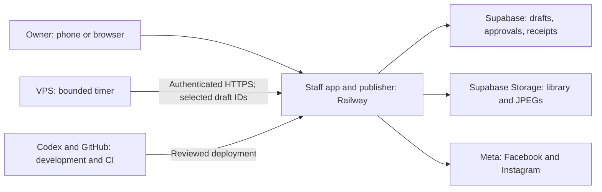

# Social publishing: rebuild guide and scheduling test

Updated September 6, 2026. Start here for the reusable implementation; [pilot receipts](PRACTICE-POST-20260906.md) retain exact history and live links. This guide separates verified components from the next test and later product work.

## What is actually running where

The VPS does not host the True Color website, run the AI model, or hold the publishing queue. Railway hosts the application and direct Meta publisher. Supabase hosts the data and media. The VPS timer supplies the recurring wake-up. Once that timer is enabled and verified, the Mac is not required to execute a scheduled delivery. A successful manual API call was never proof of an installed timer.

| Component | Current location and role | Evidence |
| --- | --- | --- |
| Canonical implementation | `tubby124/truecolor-estimator`, main; Railway production deployment | Reviewed PRs 39–41; working manual two-platform pilot |
| Publisher | Railway `truecolor-estimator`, project `truecolordisplayprinting` | Real provider delivery and independent page readback |
| Database and assets | Supabase `social_posts`, `social_post_results`, private `social-library`, public publishing derivatives in `social-images` | Approval hashes, provider IDs, image checksums and storage readback |
| Meta application | Existing **True Color Social Publisher** | September 6 protected token metadata read: valid PAGE credential tied to this application |
| Connected destinations | True Color Display Printing Ltd. Facebook Page and Instagram `@truecolorprint` | Identity read plus actual posts; never infer a connection from token presence |
| VPS | Owner's existing remote host, reached through the authorized local SSH alias | September 6 timer/standard cron inventory found no True Color social trigger before this task |
| Existing VPS repo copy | Historical checkout, not the web server or proof of current publisher code | Read-only HEAD differed from current main; it was not reset or used to deploy the app |
| Codex/Mac | Development, preparation and optional owner review | Not intended as the scheduler; no Codex desktop heartbeat is used for delivery |

The `social_accounts` table is a legacy Blotato account cache. Zero rows there does not mean the direct Meta connection is missing. The current direct publisher resolves the protected server Meta configuration. Do not build a second queue in Hermes, Drive or a local spreadsheet. Drive is a backup of the asset library, not the delivery authority.

## Why the first test took so long

The delay was concrete integration defects and deployment cycles, not simply Instagram taking longer to process an image.

| Failure | Cause | Durable correction / next-business check |
| --- | --- | --- |
| Facebook credential looked ready but Page calls failed | Granted scopes did not establish that the saved value was a Page credential | Derive/resolve the intended Page token through the existing authorized credential; verify Page-specific read, linked IG and token type before saving securely |
| Dispatch held both posts with no useful receipt | `upsert(... onConflict: post_id,platform)` assumed a production unique constraint which did not exist; zero-row probe returned PostgreSQL `42P10` | Append receipts after the existing single-dispatch claim; test the actual production schema contract, not only a permissive mock |
| Instagram created a container but stopped before publication | Poll requested `status_code,error`; `error` is not a container field | Use `status_code,status`; preserve container ID on later errors. See [Meta's official request](https://www.postman.com/meta/instagram/request/munmruq/get-ig-container-status) |
| Selecting both destinations blocked review | Batch UI wrote one mixed-platform draft while approval allowed one platform per record | One logical post expands into two destination drafts in one insert; keep the owner interaction unified |
| Hashtags differed between destinations | Instagram appends shared hashtags; Facebook publishes its caption verbatim | Materialize the final Facebook caption before review; append only missing shared hashtags |
| Repeated approval/edit screens felt like separate jobs | Internal delivery records leaked into the owner workflow | One batch review/approval; retain independent receipt and failure state internally |
| Local script failed from task checkout | Worktree was not Railway-linked | Use the verified linked checkout with absolute task-script paths; do not copy environment files or relink blindly |
| CI/deploy/checkpoint repetition consumed time | First public pilot exercised assumptions never verified against Meta and production schema | Run the compact preflight below before creative approval; deploy a bounded fix once with real contract tests |

Observed successful provider times: Facebook 05:05:16 UTC, Instagram 05:16:21 UTC. The first controlled attempt was at 04:50 UTC. Failed outcomes were reconciled before resubmission; Facebook was not repeated when Instagram was repaired. Exactly one matching published post per destination was verified. Earlier failed receipts remain historical evidence.

## Rebuild for another business: compact order

1. **Inventory before creating anything.** Identify owner/business portfolio, existing app, Page, professional Instagram and their link. Reuse a suitable existing publisher app. Do not confuse it with an unrelated ads/Conversions API application. Provider consent/access steps still use the real owner.
2. **Separate business facts from shared code.** Record business identity, timezone, desired destinations, approved facts, media provenance and voice direction. A new business is not just a changed logo or token.
3. **Install credentials directly into protected server storage.** Verify exact destination, PAGE token type, permissions and an authenticated Page read. Verify Instagram linkage. Never include tokens in chat, Git, screenshots, logs or URL-bearing receipts. A reported expiry of zero does not prevent revocation; health must still be checked.
4. **Verify schema and permissions against reality.** Nullable approval fields, server-owned version changes, staff-only writes, durable receipts, indexes expected by application code. Apply reviewed migrations to the intended project only. A mock or migration file on disk is not live schema proof.
5. **Verify media from the publishing runtime.** Uploaded JPEG, decoded bytes/dimensions, public delivery URL and SHA256. Keep private originals separate. Website/Google visibility alone is not a new social-rights approval.
6. **Prove one exact post per destination.** Real staff approval binds image, final caption/hashtags, destination and time. Capture receipt then read Meta and rendered page independently. Preserve partial success; never resend the successful platform.
7. **Add one authoritative hosted trigger.** Inventory repository workflows, Railway cron configuration, VPS timers/standard cron and known legacy integrations. Only the intended trigger receives the protected cron credential. Scope the test to exact IDs and expiry.
8. **Prove unattended delivery.** Three different creative items, morning/afternoon/night, six destinations. Read VPS timestamps, application receipts and provider timestamps. Record whether the owner's devices were actually off; do not infer that from a manual run.
9. **Extract the reusable product after that proof.** Avoid copying an unverified setup into another business. The current application is single-business; multi-business isolation is a later explicit implementation.

## Sunday batch test

Owner confirmed Sunday September 6, 2026, America/Regina:

| Logical post | Local time | UTC | Destinations |
| --- | --- | --- | --- |
| Morning | 09:00 | Sep 6 15:00Z | Instagram and Facebook |
| Afternoon | 13:00 | Sep 6 19:00Z | Instagram and Facebook |
| Evening | 19:00 | Sep 7 01:00Z | Instagram and Facebook |

The operator selected three distinct library subjects and prepared a private exact-photo/caption preview. Content and social-use permission require one owner batch review before arming. The previously posted Fowlplay photo is not reused. The 12 legacy drafts remain untouched.

The bounded VPS runner uses six explicit draft IDs, a start time, an expiry and an enabled flag. It calls a read-only scoped check first, then dispatches only due approved records. Its protected credential is the scheduler credential; it does not need Meta or Supabase administrator keys. State is written before a request: an interrupted or uncertain call holds for manual reconciliation. Completion or expiry stops further calls. It is not an automatic provider retry engine.

The application still validates approval fingerprints, exact destination, media hash, due time and the one-hour lateness limit, then atomically claims the row. `mode=check` never dispatches. A scoped request cannot include unrelated queue rows. Provider failure counts as held even if the transport returned HTTP 200. A completed Facebook result is independent of an Instagram failure.

Acceptance:

- One exact batch review; six separately bound staff approvals saved.
- Only those six IDs in the timer configuration; publishing and timer state read back on the actual hosts.
- Read-only timer check succeeds from the VPS while publishing is paused.
- With no Mac-origin invocation, each slot produces its two receipts near its scheduled time.
- Exactly six successful provider publications across three creative items, with no duplicate matching post per destination.
- Each caption/photo matches the approved version; record provider IDs and rendered links.
- Held/uncertain delivery stops automatic action and remains visible; expired jobs do not catch up in a burst.
- Completion/expiry stops further runner calls. Record final timer/queue state and pause publishing after the test.

The test has not passed merely because it is configured or because the manual pilot passed. Final time-based evidence will only exist after the scheduled slots.

## VPS installation contract

Reviewed source lives in `scripts/social/vps-scheduler.py` and `scripts/social/systemd/`. Install the runner at `/opt/truecolor-social/vps-scheduler.py` (0755), the two units under `/etc/systemd/system/`, and configuration at `/etc/truecolor-social/pilot.json` (0644). Transfer the scheduler secret directly into `/etc/truecolor-social/cron-secret` (root-owned 0600) through protected stdin, never a command argument. `LoadCredential` supplies it to the dynamic service user. Do not copy Meta or database credentials onto this runner.

Configuration has exactly four keys: `ids` (six unique delivery UUIDs), `enabled` (boolean), `notBefore` and `expiresAt` (UTC timestamps ending in Z). Keep the configuration disabled until the exact batch is approved and the remote read-only check passes. The check endpoint requires the selected IDs and validates all approval fingerprints, including future posts while publishing is paused.

Validate units with `systemd-analyze verify`, reload systemd, then exercise the installed runner with `--check` using the same credential arrangement. Only then enable `truecolor-social.timer`. Inspect service journal and `/var/lib/truecolor-social/state.json` for execution evidence. The timer ticks every minute; completion and expiry make the runner stop network calls, but do not disable the timer unit automatically. Disable the timer and pause application publishing when closing the pilot.

An uncertain call leaves a durable hold. Reconcile database receipts and Meta before changing held state; do not delete state as a retry shortcut. The expiry is also sent to the application and checked before each destination dispatch. A provider operation already started may finish after that boundary.

Local contracts: `python3 -B -m unittest discover -s scripts/social -p test_vps_scheduler.py` plus the social Vitest suites. CI runs both. Installing files is not evidence of a successful timed publication.

## Small product plan after scheduling passes

### 1. One easy publishing screen

Upload/select photos → write or generate captions → select Facebook and Instagram → choose times → **Review and schedule batch**. Default the two connected destinations, show human-readable local times and the real images. Group the six internal deliveries into three creative cards. Show one success/error summary per platform after publishing. Keep extra settings collapsed. A manual-caption path should not force an AI request.

Keep checks for rights and exact content in the one review step; do not repeat confirmations throughout the workflow. Edits should invalidate only the affected approval. Do not weaken server checks to compensate for a confusing UI.

### 2. One business profile for copy generation

A short owner form should capture:

- Who the business serves, where it operates and its main products/services.
- What posts should achieve: inquiries, bookings, orders, awareness or education; preferred CTA.
- Three voice traits, two example captions the owner likes, phrases/topics to avoid.
- Approved facts, source references, restricted claims, price/turnaround policy.
- Hashtag preferences: local tags, product tags, branded tag and desired amount.
- Photo preferences, permitted customer-work use, content exclusions and timezone.

Save a versioned profile and record the profile version used for each draft. Generate captions and hashtags together from that profile plus the specific image/product facts. Facts override tone. The current prompts are hardcoded to True Color and can conflict with the conversational pilot voice; they are not a reusable onboarding system yet.

### 3. A year plan without a year of fragile promises

Plan themes and asset rotation for the year first; generate and approve manageable batches from that calendar. Support bulk review with one action, not 365 repeated dialogs. Keep evergreen posts separate from dated offers, changing prices and seasonal claims. Refresh time-sensitive facts before release and surface affected drafts when the source changes. Record asset usage so the same image/opening/product does not repeat unnoticed.

Current batch limits are seven logical posts to both destinations (14 delivery drafts). A full-year workflow needs paginated drafts, resumable generation, reliable batch identity/idempotency, usage history and cancellation controls before increasing limits. It does not need a second queue or an autonomous agent per business.

### 4. Other-business rollout

First establish per-business destination and credential isolation, staff membership/authorization, profile/fact ownership, storage boundaries and scoped scheduling. Then test two intentionally different businesses to catch account-mixing and generic-copy failures. Keep shared publisher code separate from business configuration. Do not advertise a multi-tenant service based on one successful True Color pilot.

## Evidence locations

- Public Git: this guide, code/tests, sanitized deployment and scheduling receipts.
- Private working package: exact artwork, source manifests, draft IDs and operational credentials remain with authorized sources; no raw customer library in this public repository.
- Supabase: actual draft/approval/provider history.
- VPS journal and state directory: remote trigger execution, bounded runner state and safe diagnostic codes.
- [Setup history](SETUP-RUNBOOK.md), [pilot receipts](PRACTICE-POST-20260906.md), [asset library](ASSET-LIBRARY.md), [portable design](PORTABLE-SOCIAL-SYSTEM.md).
