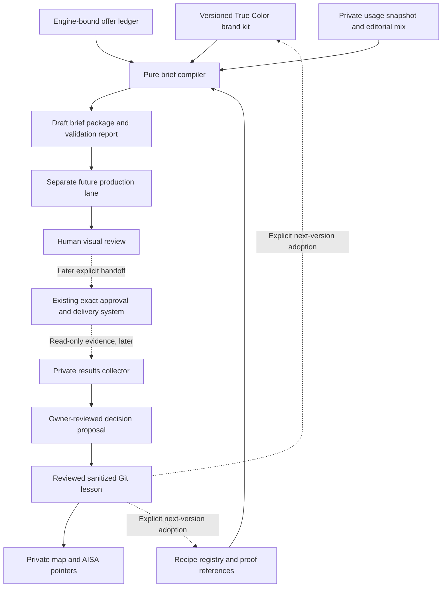

# True Color creative operating system — design for review

September 9, 2026 · **Architecture with a first offline implementation.** The owner authorized the first build after this design. Start with the [working-tool runbook](RUNBOOK.md): three text briefs, local facts and a private review page. The full calendar/collector/writeback design below remains future work; no final creative or production activation is implied.

The audit repair now has a [cross-product acceptance milestone](BUILD-PLAN.md#current-milestone--repair-the-shared-foundation). The original three sticker briefs were insufficient proof of reuse. Brand invariants, recipe execution and adapter-owned product facts must remain separate. The owner will supply style references and co-design each substantial planner decision before implementation; this repair does not authorize automatic artwork or planner construction.

Build a portable creative brief system inside the existing True Color repository. Its reusable core defines the questions, evidence bindings and quality checks; the True Color skin supplies the visual identity, product facts, proof and conversion treatment. Start with local JSON and pure validation/composition functions. A graph database, hosted service and autonomous agent loop are unnecessary for the first proof.

The desired outcome is repeated, beautiful, recognizably True Color creative with visibly different ideas. The system can enforce factual constraints and expose repetition; human visual review still decides whether a piece is good. Passing a schema does not establish premium quality or commercial performance.

Read [data contracts](CONTRACTS.md) for implementation details and [build plan and acceptance checks](BUILD-PLAN.md) for the exact first slice. This design changes no scheduling, publishing, queue, destinations, approval mechanism, spend, runtime, database or credentials. No new final media is produced. All dates and counts below describe proposals or evidence, never release instructions.

## Architecture

The last feedback edge is deliberate adoption into a new draft version, never a write to approved or published records. The collector has no path to a brand-kit mutation, runtime mutation or acceptance decision.

## Source-of-truth map and evidence read

Source snapshot: application main `0675d93d40b39e5afdc1b5e1f6e57c0004bd4e2e`, verified against GitHub September 9; PR #71 is merged. Earlier canonical local main `a7722520` and private handoff text saying PR #71 was pending are stale for Git state. No production or provider state was refreshed in this design task.

| Concern | Existing authority inspected | What this establishes |
|---|---|---|
| Project and source boundaries | [Index](../../TRUE-COLOR-INDEX.md), [current state](../../operations/CURRENT-STATE.md), [source registry](../../operations/SOURCE-REGISTRY.md), root AGENTS.md | Application Git owns sanitized implementation and accepted project decisions; public repository privacy rules apply |
| Campaign | [Accepted sticker direction](../campaigns/STICKERS-20260909.md); private September 9 campaign HANDOFF.md, final continuation section and review package | Campaign identity is `tc_stickers_small_run_pilot`; five distinct purchase questions; prepared private candidates, not final publication approval |
| Latest owner creative direction | Current task instruction plus latest private continuation | Keep “Small run. Big presence.” and clear website/address/phone panel; reject illustrative-hero logo overlay; explain custom stickers/options/configurator unmistakably |
| Price calculation | [Product facts](../../../src/lib/pricing/product-facts.ts), [engine](../../../src/lib/engine/index.ts), [sticker bridge](../../../src/lib/engine/sticker-v2-bridge.ts), [order minimum](../../../src/lib/pricing/order-min.ts), [tables](../../../data/tables) | Executable source and loaded inputs outrank copied anchors and stale comments |
| Price evidence | Private PRICING-VERIFICATION.json and .md, September 9 at 14:33:12 UTC | Prior local engine run verified the exact $25 configuration with explicit V2 flag; production runtime was not refreshed by that receipt or this task |
| Existing reusable primitives | [Business profile](../../../src/lib/social/generation/business-profile.ts), [offers](../../../src/lib/social/offers.ts), [monthly parser](../../../src/lib/social/monthly-plan.ts), [weekly planner](../../../src/lib/social/weekly-plan.ts) | Facts, presentation and planning already exist; extend through separate adapters rather than replacing their contracts |
| Branding | [Branding standard](../BRANDING-STANDARD.md), `src/app/globals.css`, private selected hero viewed in this task | Website cyan and existing fonts are source tokens; hero demonstrates cobalt, cream type, tactile product and strong contact panel. Hero palette is a campaign lane, not a verified universal brand specification |
| Learning | [Scorecard template](../campaigns/SCORECARD-TEMPLATE.json), [manual CLI](../../../scripts/social/campaign-scorecard.py) | Manual private validation/rendering exists. It validates recorded acceptance, not reviewer identity; it does not collect or prove metrics |
| Private routing | Owner-private ecosystem README.md, MAINTENANCE.md and True Color context | Map owns source pointers, not accepted business rules or live queue. Supplied-snapshot consumer proof is not autonomous retrieval/writeback |
| Reuse roadmap | Existing AISA `docs/automation-roadmap/README.md` | Roadmap is a separate owner-private source; a future lesson pointer is not a published course or multi-brand deployment |

Private locators stay in the existing owner-private campaign handoff and ecosystem route. No raw research, customer art, private filesystem paths, account exports or private access URLs belong in this public design.

### Resolve instruction conflicts explicitly

The current owner instruction overrides the older mandatory-logo bullet in the campaign record and the earlier section of the private handoff. The scoped correction now appears in the campaign record and branding standard so a new agent can resolve it directly. Existing assets, approvals and branding implementation are unchanged.

The September 9 authority section in `.claude/rules/brand-voice.md` supersedes its old universal price/design/rush mandates and the conflicting mandates in adjacent content checklists. Current owner decisions govern creative intent; executable prices and eligible maintained service facts govern factual claims. A campaign or recipe cannot override those facts. Exact priced offers require their amount and qualifiers; education, custom-options and design-help pieces may be nonpriced. Historical examples supply context, not current factual authority.

## Brand kit: stable recognition, variable compositions

**Existing sticker-campaign direction:** confident short headline, tactile product foreground, legible selling information and clear True Color contact treatment; illustrative hero overlay disabled. These are scoped campaign choices. The selected hero is a visual reference, not evidence of a real printed job or measured sales lift.

**Proposed invariants:**

- Product/service and purpose are clear; depicted material, scale and intended use remain plausible. The recipe chooses whether the subject is a product, process, person or diagram.
- Use the product/service wording supplied by the selected facts. “Custom stickers” is appropriate only for a sticker brief; a poetic headline alone does not identify the subject.
- Exact offers keep the selected adapter's price-bearing configuration and essential qualifiers visibly associated with the amount. Sticker shape is a sticker requirement, not a universal product field.
- True Color identity remains accurate: `truecolorprinting.ca`, `216 33rd St W, Saskatoon`, `306-954-8688`. The full record preserves “upstairs” and postal address. Required action fields follow the brief's policy; layout, presentation and campaign colour belong to the recipe. Other brands supply their own identity and requirements.
- Exact brand marks are optional, never generated or approximated. Hero lane defaults to no overlay; a real-work lane can propose a corner mark only with clear space and visual review. Preserve customer artwork. Branding is composed before final review, never at dispatch.
- Plain, local voice. “Small run. Big presence.” is an approved direction for this campaign, not compulsory recurring copy or a permanent company tagline.

**Proposed sticker recipe lanes, not brand invariants:**

| Lane | Audience experience | Distinct composition | Suitable proof |
|---|---|---|---|
| Colour studio | Bold, tactile, immediate | Large product hero, saturated campaign colour, restrained props | Explicit illustrative design example |
| Material study | Quiet, precise, considered | Neutral/ivory field, macro detail, ruler or dimension diagram with correct units | Illustration or cleared real detail; no invented physical test |
| Real work | Tangible local credibility | Authentic shop/customer result; minimal overlay, honest context | Privately cleared source with actual-work evidence |
| Design desk | Useful design judgment | Readability/spacing comparison, flat artwork or type study | Original design example, never an invented client commission |
| Ordering guide | Easy next step | Numbered choices or annotated verified interface | Diagram labelled as diagram; dated screenshot only if actually captured |

Website tokens currently include cyan `#16c2f3`, foreground `#111111`, background `#f8f8f8` and Geist font variables. Proposal: retain these as identity references, use campaign-specific cobalt/ivory/dark lanes as controlled overrides, and select renderable fonts from already available licensed assets in production. Do not claim sampled hero colours or approximate fonts are official brand tokens.

Panel candidates: dark base strip, light editorial margin, or integrated negative-space block. Keep the same identity and action hierarchy; never stamp the identical footer/hero composition across the whole month. Proposed 1080-wide layout guide: 48px minimum safe inset and 36px minimum essential contact/qualifier text, inspected at 360px-wide phone preview. Use at most two font families and three type roles. These are review defaults, not platform specifications or reasons to shrink a long configuration into unreadability.

## Offer ledger: a priced configuration is not a product-wide promise

The ledger stores permitted *claims* and their bindings, not a second price engine. `resolveProductFacts()` supplies current product facts and its existing source fingerprint. The OS adds a separate brief/offer digest; it never manufactures the application's fact fingerprint.

The dated verified example is CAD $25 before tax for **25 square 2×2-inch white-vinyl stickers, one side, print-ready artwork, no addons, no rush**. Material binding is `PLACEHOLDER_STICKER_2X2`, not a guessed base-film alias. Its prior receipt has cost null, so margin stays unknown. A different quantity, material, shape, size, design scope or rush request creates a different configuration. No blanket “custom stickers $25”, “any size $25”, “design included” or inferred discount.

Offer modes:

1. `exact_configuration`: current resolver success, complete configuration and standalone pretax total, minimum disclosure and qualified copy.
2. `configurator`: verified capability and explicit choices, no amount; CTA asks users to select their own configuration. Supported variants are sourced, never guessed.
3. `custom_request`: unresolved type/shape/size or capability evidence; no amount and no promised availability. If an inquiry channel is verified, the brief can ask about the requirement; otherwise hold it.
4. `service`: separate verified design service facts. Existing product-facts/monthly contracts constrain print-ready/no-rush configurations; a design-inclusive quote requires its own future validated adapter. The dated $40 design receipt is evidence, not permission to widen the existing parser.

For numeric option comparisons, resolve every displayed alternative independently and bind each price to its own configuration. A price range needs defined endpoints and a bounded supported domain; unbounded custom pricing never becomes a fabricated range. Initial pilot excludes ranges entirely.

The sticker URL defaults to a different configuration; no preselected URL is verified. The CTA must tell the buyer to select the displayed options. Do not generate query parameters that pretend to prefill them. In future channel rendering, a visible Instagram caption URL is not counted as a clickable conversion path; use only a separately verified placement, without changing profile links from this system.

## Recipe registry and monthly composition

A recipe specifies a purchase question, proof requirement and information hierarchy, not fixed pixels. Start with five sticker recipes: small batch; size/fit; print-ready versus design help; authentic result or clearly labelled illustration; configurator walkthrough. Registry also supports future product-specific real-work and education recipes. Each output includes its question, product, offer mode, proof type, CTA treatment and diversity signature.

The composer receives a caller-specified editorial slot count, eligible catalogue products, available proof and a read-only usage snapshot. It does not choose posting cadence. Month label and ordinal/week grouping are editorial context; output contains no `scheduleTime`, destination IDs, approval state or publish command.

Proposed ordinary 20-slot review sample: 8 real-work/process, 6 education/size/design, 4 configurator/help, 2 exact offers; at least four verified product families, no family above 35%. Categories for consideration include stickers, banners, signs and paper print, but an unavailable fact/proof set creates a visible gap rather than invented content. The five-piece sticker campaign is a separately scoped campaign sequence; the composer must not overwrite it or treat its all-sticker focus as an ordinary mixed-month failure.

Proposed ordinary-mode constraints: no adjacent same product family, purchase question or dominant layout; at least three visual lanes per seven slots; no identical headline in a month; no exact asset reuse in a month; reviewed near-duplicate groups count as the same visual. Prefer a balance of dark/light fields, macro/environment scale, diagram/photo and contact-panel treatments. A saturated-blue packaging hero recoloured pink is still the same composition. A Facebook/Instagram rendition pair counts as one creative, not two diversity wins.

Algorithm: validate inputs → remove ineligible facts/proof → construct feasible candidates → fill constrained slots with deterministic scoring and bounded backtracking → report gaps and soft-goal scores. Stable seed and sorted IDs make results reproducible. Empty or sparse libraries return `needs_source` slots and unsatisfied constraints. No silent fallback to uncleared images, repeated heroes or fictional actual-work proof. Recommendations explain why each selection was made. Availability and campaign purpose outweigh filling a nominal count.

Usage snapshots include published, approved/pending and proposed work as separately labelled observations. Offline planning does not reserve live assets; stale or incomplete snapshots produce a warning and require later reconciliation. Intra-plan uniqueness is enforceable now. Cross-task concurrency reservations require a separately authorized future integration with the existing usage owner.

## Learning loop and deliberate phase boundary

The manual scorecard remains the evidence-review foundation. Visual preference and commercial evidence are different learning kinds: an owner can accept “omit the overlay on illustrative heroes” immediately as taste direction; “this lane generates more sales” requires attributed outcome evidence and limitations. Neither implies the other.

One-way promotion is **private evidence → owner-reviewed decision → sanitized Git lesson → private map/AISA pointer**. Pending/rejected observations can remain private indefinitely. A lesson changes future briefs only after explicit version adoption. A map pointer or old chat cannot confer acceptance, override a new campaign instruction or rewrite a published post.

After schema and visual proof, the collector will use read-only source adapters and private append-only snapshots. It will preserve source windows, timezone, attribution cohort, missing data and partial failures. After that is proven, a small Git-based pointer writer can update the existing private map and a Vault index. A materialized graph can be derived from lesson IDs and links later; it must not become another source of accepted business truth.

Tradeoff: JSON plus pure functions has modest manual work and no automatic synchronization, but is auditable, portable, inexpensive and easy to delete or migrate. A hosted database/graph would add credentials, identity, concurrency and recovery obligations before any creative benefit is proven. Revisit storage only after measured volume or multi-writer requirements exceed the file workflow.
