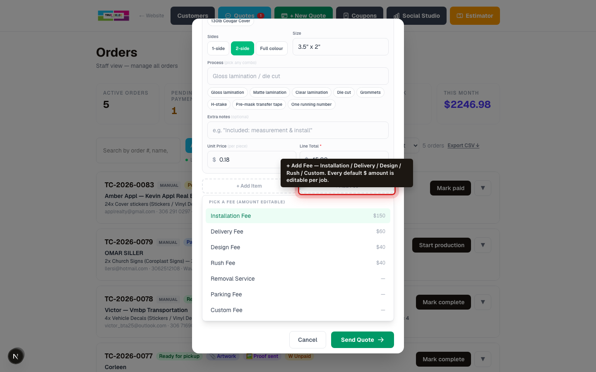

# Custom Quote walkthrough — for True Color staff

How to quote any job inside the website, even when the estimator can't handle it.

This is the same job as Wave invoice **#980** (Tridah Media, $134.31). Four lines:

1. 2× "Your Off-Site Creative Department" — 5mm foamboard, 1-side, 11×17 in, matte lamination — $18 each
2. 1× "The Power of Branding" — 5mm foamboard, 1-side, 18×24 in, matte lamination — $30
3. 1× "Win 1 Month of Design" — 14pt cardstock, 2-side, 8.5×11 in, matte lamination — $10
4. 250× Business Cards — 14pt, 2-side, 3.5×2 in — $0.18 each

Subtotal $121.00 + GST $6.05 + PST $7.26 = **$134.31 CAD**

---

## 1. Click "Manual Order" on the orders page


The green button on /staff/orders opens the Custom Quote / Manual Order modal.

You can also click **"Custom Quote"** from /staff or /staff/quotes — it opens the same modal pre-toggled to quote-only.

## 2. Modal opens


When you arrive via the **Custom Quote** link, the Quote-only toggle starts ON. When you click **Manual Order** directly, it starts OFF (full invoice with payment link).

## 3. Enter the customer


Two ways to load a customer:

- **Type the email** — if they've ordered before, name/company/phone autofill automatically.
- **Click "Browse past customers →"** in the top-right of Step 2 — opens a search dialog. Type any part of their name, email, or company. Click a row → all their info fills in. **Best for returning customers when you don't remember their email.**

New customers get a Supabase account created automatically when you send the quote/invoice.

## 4. Line 1 — "Your Off-Site Creative Department" (foamboard 11×17, qty 2)


Each item card now uses the same shape Albert uses in his quotes — **Material / Sides / Size / Process** as separate fields. Every field accepts a click-a-chip shortcut OR typed text.

- **Line Title:** "Your Off-Site Creative Department" (shows on the invoice as the headline)
- **Product:** type "Foamboard" — combobox suggests matches. Or pick **Foamboard Displays** from the dropdown. **You can type ANYTHING here** — if it's not in the list (e.g. "Plinko Stickers", "Shelf Talkers", "Yard Signs"), it's used as-is. No more falling back to "Other".
- **Qty:** 2
- **Material:** click the **5mm Foamboard** chip — fills the field. Or type your own.
- **Sides:** click **1-side** chip → fills "One side full colour printing" (matches Albert's wording).
- **Size:** type `11" x 17"`
- **Process:** click **Matte lamination** chip. Multi-select OK — click multiple chips and they join with " / " (e.g. "Gloss lamination / Die cut").
- **Unit Price:** $18.00 → **Line Total** auto-fills to $36.00

The customer will see this in the email as a clean spec block:

```
Material : 5mm Foamboard
Colour   : One side full colour printing
Size     : 11" x 17"
Process  : Matte lamination
Quantity : 2
Unit Price : $ 18.00 for each
Total amount : $ 36.00 plus tax
```

## 5. Line 2 — "The Power of Branding" (foamboard 18×24, qty 1)


Click **+ Add Item** at the bottom of the items list (up to 10 lines per quote).


Same chip flow — 5mm Foamboard / 1-side / Matte lamination — just a different size.

## 6. Line 3 — "Win 1 Month of Design" (cardstock 8.5×11, qty 1)


Pick **Paper / Document Printing** as the product. Material chip: **14pt Cardstock**. Sides: **2-side**. Process: **Matte lamination**.

## 7. Line 4 — Business Cards (250 × $0.18)


No title needed — the product name speaks for itself. Material **14pt Cardstock**, sides **2-side**, size `3.5" x 2"`. Unit Price $0.18 × Qty 250 → line total auto-fills to **$45.00**.

## 7b. (Optional) Add a fee



For Installation, Delivery, Design, Rush, Parking, Removal, or any custom fee — click **+ Add Fee** instead of + Add Item. A picker drops down with the common fee types and their *default* amounts:

- Installation Fee — default $150
- Delivery Fee — default $60
- Design Fee — default $40
- Rush Fee — default $40
- Removal Service — blank (type your own)
- Parking Fee — blank
- Custom Fee — blank

**The default amounts are just hints.** Once added, type whatever this specific job actually costs. A 4-hour install isn't $150 — make it $300. A simple drop-off delivery isn't $60 — make it $20. **Everything is editable per job.**

Fee lines render as a single line in the customer email — no spec block, just **Name : $Amount plus tax**.

## 8. Confirm totals match Wave invoice #980


Subtotal $121.00 / GST $6.05 / PST $7.26 / Total **$134.31** — exactly what Wave invoice #980 shows.

## 9. Pick how to bill it


- **Card Link (Clover)** — customer gets a link to pay by credit/debit card
- **Wave Invoice** — customer gets the Wave invoice email with pay-online + e-transfer instructions

In Quote mode (default), this is just where the invoice gets prepared as a draft. Nothing sends to the customer until you flip to Send Invoice mode at the top.

## 10. Pick a mode — Quote (default) or Invoice

This is at the **top** of the modal. Big buttons. Pick one.


**📝 Send Quote (default)** → Customer gets an email summarizing the line items with an "Approve Quote" button. They reply, call, or click to approve. **No payment link, no money asked for yet.** Wave invoice stays as a draft you'll send once they confirm. **Use this 90% of the time.**


**💳 Send Invoice** → Customer immediately gets the full invoice with the payment link. Wave invoice is approved + sent in one step. **Only click this after the price is agreed.**

**Rule of thumb:** If the customer hasn't said "yes, go ahead and bill me" → click Send Quote. If they have → click Send Invoice.

## 11. Send


Button label changes based on the toggle: **"Send Quote"** (quote-only) or **"Send Invoice"** (full).

## 12. Order appears in the list


The new order shows at the top of /staff/orders. Click it to view line items, change status, or convert a quote to a sent invoice later.

---

## When to use this instead of the estimator

| Job type | Use estimator (`/staff`) | Use Custom Quote |
|---|:---:|:---:|
| Standard banner / coroplast / sign / business cards / flyer (catalog sizes + qty) | ✅ | |
| Foamboard with lamination | | ✅ |
| Non-catalog dimensions (e.g. 11×17, 8.5×11 foamboard) | | ✅ |
| Below-catalog quantity (e.g. qty 1–99 flyers) | | ✅ |
| Custom project title on invoice ("The Power of Branding") | | ✅ |
| Owner-set special price (loss-leader, friends-and-family rate) | | ✅ |
| Multi-product agency invoice (3–10 mixed items) | | ✅ |

If you can't find what you need in the estimator dropdowns, go straight to **Custom Quote**. Always.

---

*Regenerated: 2026-05-20 — by manual-order-walkthrough.spec.ts*
